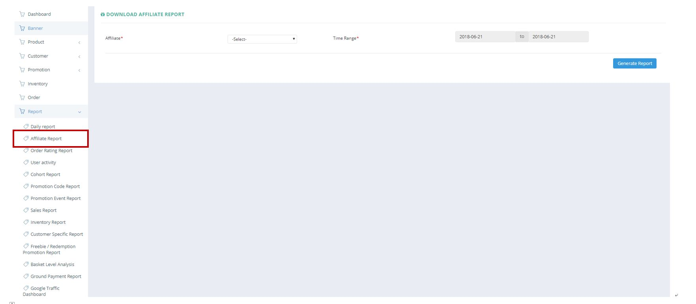
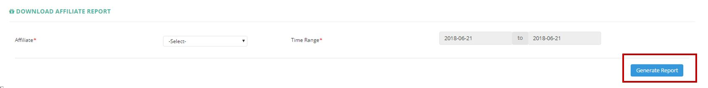

************
Affiliate Report Module 
************
Users can extract the Order Details generated from different Affiliate Partners that Ztore is being advertised or referred from their websites.

|Affiliatereportmodule|

.. list-table:: Affiliate Report Module
    :widths: 10 50
    :header-rows: 1
    :stub-columns: 1

    * - FIELD NAME
      - FIELD DESCRIPTION
    * - Affiliate
      - The partners of Ztore making referral or promotions from their website to Ztore
    * - Time Range
      - The Date Range of Information to be Extracted for The Affiliate Report
 
Affiliate Report
==================
Users can Export different Affiliate Reports by selecting the “Affiliate” and Time Range when clicking on the “Generate Report” button.

|Affiliatereport|

.. list-table:: Affiliate Report Column Headings
    :widths: 10 50
    :header-rows: 1
    :stub-columns: 1

    * - FIELD NAME
      - FIELD DESCRIPTION
    * - Affiliate Code
      - The Affiliate Code
    * - Affiliate ID
      - The Affiliate ID
    * - Publisher ID
      - The Publisher ID
    * - Order No
      - The Order ID
    * - Order Date
      - The Date of Order
    * - Sales Amount
      - The Sales Amount of The Order
    * - Bill Amount
      - The Total Billing Amount of The Order
    * - Order Status
      - Active/ Inactive Order

