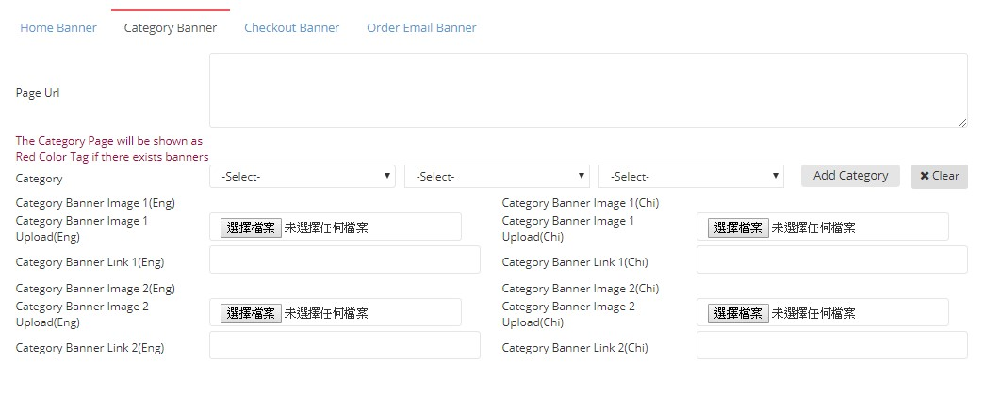

************
Banner Module 
************
Banner Module displays the details of different Banners made by our colleagues for promotion.

|Bannermodule|

.. list-table:: Banner Module
    :widths: 10 50
    :header-rows: 1
    :stub-columns: 1

    * - FIELD NAME
      - FIELD DESCRIPTION
    * - ID
      - The Banner ID
    * - Name
      - The Name of the Banner
    * - Sort Order (Home)
      - The Relative Importance of Home Banner Sorting
    * - Start Date
      - The Starting Day of posting the banner on website
    * - End Date
      - The Final Day of posting the banner on website
    * - Neighbor
      - The field states that banner is only display for 'VIP' customers or not
    * - Home?
      - "Yes" or "No" Banner on Home Page?
    * - Category?
      - upload a banner and display it in your selected category page. You can select more than one category to display.
    * - Checkout?
      - upload a banner and display it in different checkout pages. E.g. you can set the banner display in checkout/cart,         checkout/address... 
    * - Shop
      - This banner group belongs to which shop. Almost banner group also belongs to Ztore. The home banner will be displayed in Home page https://www.ztore.com. For other shop, e.g. 社企, the home banner will be displayed in shop landing page https://www.ztore.com/tc/shop/group/Social-Enterprises
    * - Status
      - Active/ Inactive Banner
    * - Action
      - Edit - Edit Banner Item Information, Delete - Delete Banner Item
        
Buttons
==================
Users can Create and Search for Banner by clicking on the buttons on top of the Banner table.

|Bannerbuttons|

.. list-table:: Banner Module Buttons
    :widths: 10 50
    :header-rows: 1
    :stub-columns: 1

    * - FIELD NAME
      - FIELD DESCRIPTION
    * - Create Banner
      - Users can create new Banner by inputting Banner details into the popup window
    * - Other Search
      - User can filter Banner items by their status
    * - Id, name, image name Input Box
      - User can carry out easy search by inputting Banner details into the Input Box

Create Banner
==================
Users can create new Banner item by clicking on the “Create Banner” button on top of Banner table.

|Bannercreate|

.. list-table:: Create Banner
    :widths: 10 50
    :header-rows: 1
    :stub-columns: 1

    * - FIELD NAME
      - FIELD DESCRIPTION
    * - ID
      - The Banner ID
    * - Name
      - The Name of the Banner
    * - Start Date
      - The Starting Day of posting the banner on website
    * - End Date
      - The Final Day of posting the banner on website
    * - Promotion Id
      - The id of promotion which connects with this banner group. If set, the banner will be inactivated when the promotion end
    * - Neighbor
      - The field states that banner is only display for 'VIP' customers or not
    * - Shop 
      - This banner group belongs to which shop. Almost banner group also belongs to Ztore. The home banner will be displayed in Home page https://www.ztore.com. For other shop, e.g. 社企, the home banner will be displayed in shop landing page https://www.ztore.com/tc/shop/group/Social-Enterprises
    * - Status
      - Active or Inactive Banner
      
      

Create Banner - Home Banner
------------------
Users can enter the details of Banner according to different Banner Types. For Home Banner, users can select the “Home Banner” session in the lower part of the Create Banner popup window.

|Createbannerhomebanner|

.. list-table:: Create Home Banner
    :widths: 10 50
    :header-rows: 1
    :stub-columns: 1

    * - FIELD NAME
      - FIELD DESCRIPTION
    * - Link(Eng.)
      - The Link of English Home Banner 
    * - Link(Chi)
      - The Link of Chinese Home Banner 
    * - Home Banner Link Type
      - The home banner link is internal website or external website.Internal website: Browser will navigate to the ztore page using same browser tag (example link: https://www.ztore.com/tc/promotion/1003014)External website: Browser will open a new browser tag to display the external website (example link: https://hk.shop.com/?tkr=s16776)
    * - Sort Order
      - The Relative Importance of Home Banner 
    * - Home Banner Image Upload(Eng.)
      - Upload The English Home Banner Image Here
    * - Home Banner Image Upload(Chi)
      - Upload The Chinese Home Banner Image Here

Create Banner - Category Banner
------------------

Users can enter the details of Banner according to different Banner Types. For Category Banner, users can select the “Category Banner” session in the lower part of the Create Banner popup window.

|Createbannercategorybanner|

.. list-table:: Create Category Banner
    :widths: 10 50
    :header-rows: 1
    :stub-columns: 1

    * - FIELD NAME
      - FIELD DESCRIPTION
    * - Page Url
      - The Link of Category Banner 
    * - Category
      - The Corresponding Category assigned to The Banner 
    * - Category Banner Image 1 Upload (Eng)
      - Upload The English Category Banner Image 1 Here
    * - Category Banner Image 1 Upload (Chi)
      - Upload The Chinese Category Banner Image 1 Here 
    * - Category Banner Link 1 (Eng)
      - The Link of English Category Banner Image 1 
    * - Category Banner Link 1 (Chi)
      - The Link of Chinese Category Banner Image 1
    * - Category Banner Image 2 Upload (Eng)
      - Upload The English Category Banner Image 2 Here
    * - Category Banner Image 2 Upload (Chi)
      - Upload The Chinese Category Banner Image 2 Here
    * - Category Banner Link 2 (Eng)
      - The Link of English Category Banner Image 2
    * - Category Banner Link 2 (Chi)
      - The Link of Chinese Category Banner Image 2
 
Create Banner - Checkout Banner
------------------
Users can enter the details of Banner according to different Banner Types. For Checkout Banner, users can select the “Checkout Banner” session in the lower part of the Create Banner popup window.

|Createbannercheckoutbanner|

.. list-table:: Create Checkout Banner
    :widths: 10 50
    :header-rows: 1
    :stub-columns: 1

    * - FIELD NAME
      - FIELD DESCRIPTION
    * - Sort Order
      - The Relative Importance of Checkout Banner
    * - Page Url
      - The Link of Checkout Banner 
    * - Checkout Banner Link(Eng)
      - The Link of English Checkout Banner 
    * - Checkout Banner Link(Chi)
      - The Link of Chinese Checkout Banner 
    * - Checkout Banner Image Upload(Eng)
      - Upload The English Checkout Banner Image Here
    * - Checkout Banner Image Upload(Chi)
      - Upload The Chinese Checkout Banner Image Here
    
Create Banner - Order Email Banner
------------------
Users can enter the details of Banner according to different Banner Types. For Order Email Banner, users can select the “Order Email Banner” session in the lower part of the Create Banner popup window.

|Createbannerorderemailbanner|

.. list-table:: Create Order Email Banner
    :widths: 10 50
    :header-rows: 1
    :stub-columns: 1

    * - FIELD NAME
      - FIELD DESCRIPTION
    * - Order Email Banner Start Date
      - The Starting Day of posting the Order Email Banner 
    * - Order Email Banner End Date
      - The Final Day of posting the Order Email Banner 
    * - Order Email Banner Status
      - Active or Inactive Order Email Banner
    
Other Search
==================
User can filter the Banner by their Status when clicking on the “Other Search” button on top of the Banner Table

|Bannerothersearch|

.. list-table:: Other Search
    :widths: 10 50
    :header-rows: 1
    :stub-columns: 1

    * - FIELD NAME
      - FIELD DESCRIPTION
    * - Get Active Banner
      - Display Banner with “Active” Status 
    * - Get All
      - Display All Banner 
    * - Get Home Banner
      - Display all Home Banner Category Banner
    * - Get Active Home Banner 
      - Display all Home Banner Category with “Active” Status Banner.
      
      
.. |Bannermodule| image:: Bannermodule.jpg

