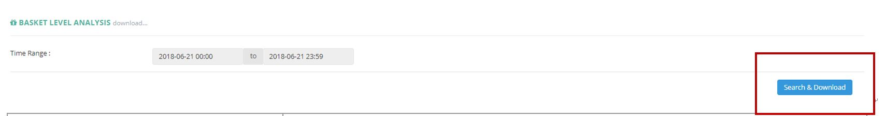

************
Basket Level Analysis Module
************
Users can Export Basket Level Analysis Data from The Module.

|Basketlevelanalysismodule|

.. list-table:: Basket Level Analysi Module 
    :widths: 10 50
    :header-rows: 1
    :stub-columns: 1

    * - FIELD NAME
      - FIELD DESCRIPTION
    * - Time Range
      - The Date Range of Information to be Extracted for The Basket Level Analysis
      
Basket Level Analysis Report
==================    
User can Extract Basket Level Analysis Data by clicking on the “Search &Download” button and specifying the Data Time Range.

|Basketlevelanalysisreport|

.. list-table:: Basket Level Analysi Report Column Headings
    :widths: 10 50
    :header-rows: 1
    :stub-columns: 1

    * - FIELD NAME
      - FIELD DESCRIPTION
    * - Customer ID
      - The Customer ID
    * - Email
      - The Customer Email
    * - VIP
      - "Yes" or "No" Customer is VIP
    * - No. of Purchase
      - The Number of Purchase by The Customer
    * - Total Spending
      - The Total Spending of The Customer
    * - Total Spending (Category Addup)
      - Total Spending (Category Addup)
    * - Avg. Basket Level
      - The Average Basket Level of The Customer
    * - Difference
      - The difference between Total Spending of The Customer and Average Basket Level
    * - 糧油雜貨
      - The Total Spending on "糧油雜貨" Category of The Customer
    * - 飲品
      - The Total Spending on "飲品" Category of The Customer
    * - 個人護理
      - The Total Spending on "個人護理" Category of The Customer
    * - 酒及廚酒
      - The Total Spending on "酒及廚酒" Category of The Customer
    * - 零食餅乾
      - The Total Spending on "零食餅乾" Category of The Customer
    * - 糧油雜貨%
      - The Proportion of Spending on "糧油雜貨" Category by The Customer
    * - 飲品%
      - The Proportion of Spending on "飲品" Category by The Customer
    * - 個人護理%
      - The Proportion of Spending on "個人護理" Category by The Customer
    * - 酒及廚酒%
      - The Proportion of Spending on "酒及廚酒" Category by The Customer
    * - 零食餅乾%
      - The Proportion of Spending on "零食餅乾" Category by The Customer
    * - Total%
      - The Toal Percentage of Spending (Add up Category % =1)

      

