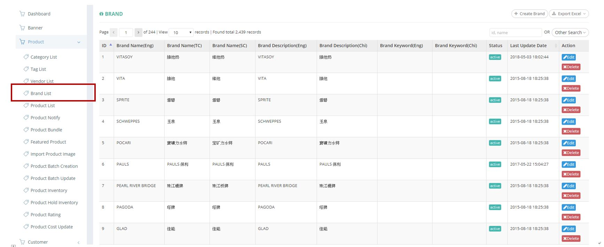
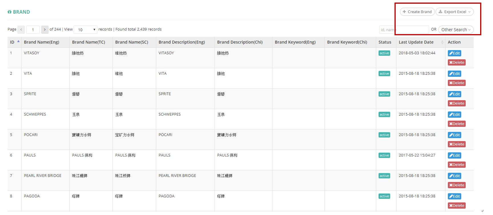
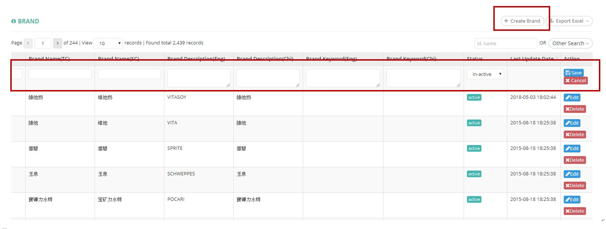
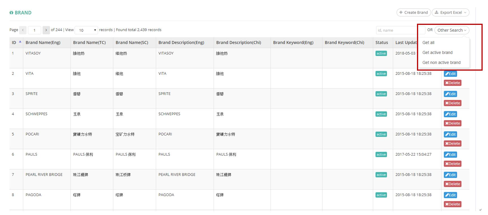
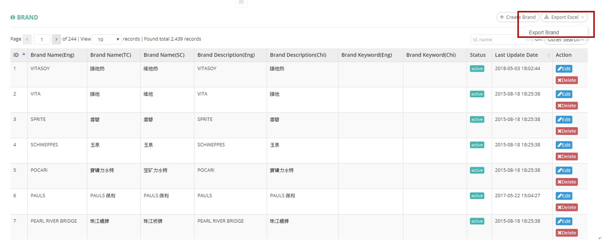

************
Brand List Module 
************

Brand List Module shows the details of different Brands in the Table. User can create new Brand items, search and export Brand items by clicking on the buttons on top of the Brand List table. You can also edit and delete Brand items by clicking on the corresponding buttons in the “Action” column.

|Brandmodule|

.. list-table:: Brand Module
    :widths: 10 50
    :header-rows: 1
    :stub-columns: 1

    * - FIELD NAME
      - FIELD DESCRIPTION
    * - ID 
      - The Brand ID
    * - Brand Name(Eng)
      - The Name of Brand in English
    * - Brand Name(TC)
      - The Name of Brand in Traditional Chinese
    * - Brand Name(SC)
      - The Name of Brand in Simplified Chinese
    * - Bran Description(Eng)
      - The Description of Brand in English
    * - Bran Description(Chi)
      - The Description of Brand in Chinese
    * - Brand Keyword(Eng)
      - The English Brand Keyword
    * - Brand Keyword(Chi)
      - The Chinese Brand Keyword
    * - Status
      - Active/ Inactive Brand
    * - Last Update Date
      - The Latest Update Date of The Brand
    * - Action
      - Edit - Edit Brand Item Information, Delete - Delete Brand Item
      
Buttons
==================
Users can create and search Brand items by clicking on the buttons on top of the Brand table. You can also export Brand details in Excel format with those buttons.

|Brandbuttons|

.. list-table:: Brand Module Buttons
    :widths: 10 50
    :header-rows: 1
    :stub-columns: 1

    * - FIELD NAME
      - FIELD DESCRIPTION
    * - Create Brand
      - User can create new Brand by inputting Brand details into the Popup window.
    * - Export Excel
      - Users can export Brand details in Excel format
    * - Other Search
      - Users can filter Brands quickly by their Brand status
    * - Id, name Input Box
      - Users can do quick search by inputting Brand ID or Name into the input box
      
Create Brand
==================
Users can create new Brand by clicking the “Create Brand” button on top of the Brand table and input Brand details into the popup window.

|Createbrand|

.. list-table:: Create Brand Page
    :widths: 10 50
    :header-rows: 1
    :stub-columns: 1

    * - FIELD NAME
      - FIELD DESCRIPTION
    * - Brand Name(Eng)
      - The Name of Brand in English
    * - Brand Name(TC)
      - The Name of Brand in Traditional Chinese
    * - Brand Name(SC)
      - The Name of Brand in Simplified Chinese
    * - Brand Description(Eng)
      - The Description of Brand in English
    * - Bran Description(Chi)
      - The Description of Brand in Chinese
    * - Brand Keyword(Eng)
      - The English Brand Keyword
    * - Brand Keyword(Chi)
      - The Chinese Brand Keyword
    * - Status
      - Active/ Inactive Brand
    * - Action
      - Save - Save New Brand Item Information, Cancel - Cancel Creating New Brand Item

Other Search
==================
Users can filter Brand items easily by their Brand status when click on the “Other Search” items on top of the Brand table.

|Brandothersearch|

.. list-table:: Brand Other Search Page
    :widths: 10 50
    :header-rows: 1
    :stub-columns: 1

    * - FIELD NAME
      - FIELD DESCRIPTION
    * - Get all
      - Show All Brand Items
    * - Get active brand
      - Show Brand Items with "Active" Status
    * - Get non-active brand
      - Show Brand Items with "not active" Status
   
Brand Report
==================
Users can export Brand details in Excel format by clicking on the “Export Excel” button on top of the Brand table.

|Brandreport|

.. list-table:: Brand Other Column Headings
    :widths: 10 50
    :header-rows: 1
    :stub-columns: 1

    * - FIELD NAME
      - FIELD DESCRIPTION
    * - ID
      - The Brand ID
    * - Brand Name(Eng)
      - The English Brand Name
    * - Brand Name(Chi)
      - The Chinese Brand Name
    * - Brand Description(Eng)
      - The English Brand Description
    * - Brand Description(Chi)
      - The Chinese Brand Description
    * - Brand Keyword(Eng)
      - The English Brand Keyword
    * - Brand Keyword(Chi)
      - The Chinese Brand Keyword
    * - Last Update Date
      - The Latest Update Date of The Brand
    * - Status
      - Active/Inactive Brand
      
      
      

