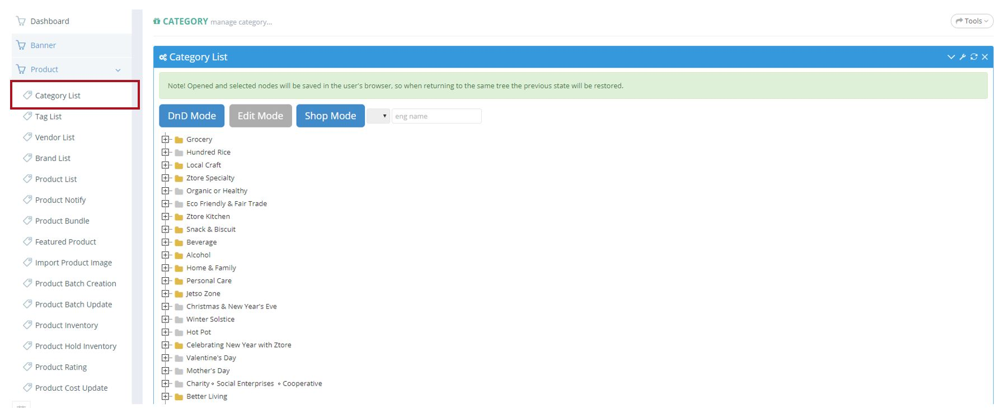

************
Category List Module 
************

Users can manage the Category Details by using different Modes listed on top of the Category List.

|Categorymodule|

.. list-table:: Category List Module
    :widths: 10 50
    :header-rows: 1
    :stub-columns: 1

    * - FIELD NAME
      - FIELD DESCRIPTION
    * - DnD Mode
      - For Drag and drop to update ordering of category
    * - Edit Mode
      - Use to update category information
    * - Shop Mode
      - Only allow to list and edit category under selected shop
    

