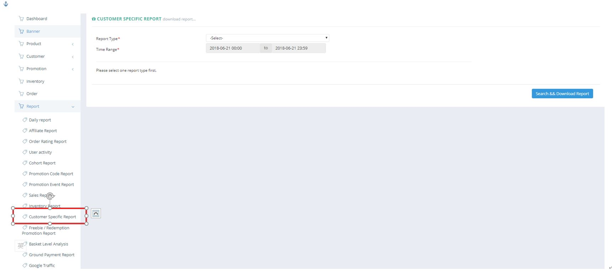
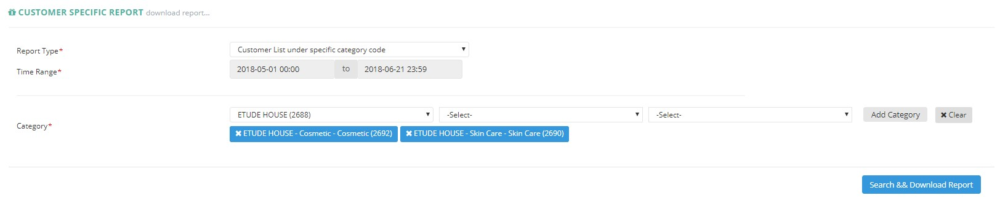

************
Customer Specific Report Module 
************
Customer Specific Report Module displays the Customer Data under specific criteria selected by the User. The Report generated will only list out Customers who satisfies the criterion.

|Customerspecificreportmodule|

.. list-table:: Banner Module
    :widths: 10 50
    :header-rows: 1
    :stub-columns: 1

    * - FIELD NAME
      - FIELD DESCRIPTION
    * - Report Type
      - Select The Type of Customer List to Generate
    * - Time Range
      - The Date Range of Information to be Extracted for The Customer Specific Report
    * - Category
      - The Category of Products as Customer Specific Criterion
      
      
Search & Download Customer Specific Report
==================
Users can download Customer Specific Report by clicking on the “Search & Download Report” button.   
   
|Searchanddownloadcustomerspecific|

.. list-table:: Search and Download Customer Specific Report
    :widths: 10 50
    :header-rows: 1
    :stub-columns: 1

    * - FIELD NAME
      - FIELD DESCRIPTION
    * - SN
      - The Customer ID
    * - Name
      - The Customer Name
    * - Email
      - The Customer Email
    * - Content no
      - The Contact Number of The Customer
    * - Mobile no
      - The Mobile Number of The Customer
    * - Total order times
      - The Total Order Times of The Customer
    * - Target order times
      - The Target Order Times of The Customer
    * - Target order times %
      - The Proportion of Total Order Times Over Target Order Times
    * - Total QTY of target products
      - The Total Quantity of Target Products Ordered by The Customer
    * - Total price of target products
      - The Total Price of Target Products Order by The Customer
    

