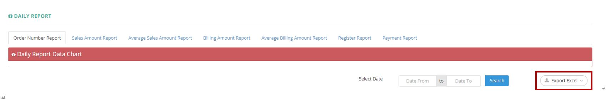

************
Daily Report Module 
************
Daily Report Module displays the Daily Figures (Order Number, Sales Amount etc.) across the Date Range specified by Users.

|Dailyreportmodule|

.. list-table:: Banner Module
    :widths: 10 50
    :header-rows: 1
    :stub-columns: 1

    * - FIELD NAME
      - FIELD DESCRIPTION
    * - Order Number Report
      - The graph plot Daily Order Number against corresponding days
    * - Sales Amount Report
      - The graph plot Sales Amount against corresponding days
    * - Average Sales Amount Report
      - The graph plot Average Sales Amount against corresponding days
    * - Billing Amount Report
      - The graph plot Billing Amount against corresponding days
    * - Average Billing Amount Report
      - The graph plot Average Billing Amount against corresponding days
    * - Register Report
      - The graph plot Total Registration Numbers, Number of Registration With Facebook, Number of Registration Through Referral Link, Number of Orders, Number of First Purchase, Number of Promotion Code Used against corresponding days
    * - Payment Report
      - The graph plot Payment from different Channels against corresponding days
    * - Date
      - The Report Date
    * - Total num of orders
      - The Total Number of Orders made by Customers
    * - Total sales amount
      - The Total Sales Value of all Orders of the Date
    * - Average Sales Amount
      - The average Sales Amount of a single Order of the Date
    * - Total Billing Amount
      - The Total Billing Amount of all Orders of the Date
    * - Average Billing Amount
      - The Average Billing Amount of a single Order of the Date
    * - ZDollar Used
      - The Amount of Zdollar used in all Orders of the Date
    * - Delivery Fee
      - The Total Amount of Delivery Fee of all Orders of the Date
    * - Other Promotion
      - The Total Amount of Other Promotion Used by Customer of all Orders of the Date
    * - Discount Rate
      - The Discount Rate of Total Sales Amount by Customers of all Orders of the Date
      

Daily Report
==================
Users can Export the selected Daily Figures with Specific Date Range in Excel Format by clicking on the “Export Excel” button.

|Dailyreport|

.. list-table:: Daily Report Column Headings
    :widths: 10 50
    :header-rows: 1
    :stub-columns: 1

    * - FIELD NAME
      - FIELD DESCRIPTION
    * - DATE
      - The Corresponding Date of Information in The Row
    * - TOTAL NUM OF ORDERS
      - The Total number Orders Made in The Day
    * - TOTAL SALES AMOUNT
      - The Total Sales Amount Made in The Day
    * - AVERAGE SALES AMOUNT
      - The Average Sales Amount per Order of The Day
    * - TOTAL BILLING AMOUNT
      - The Total Billing Amount of The Day
    * - AVERAGE BILLING AMOUNT
      - The Average Billing Amount of The Day
    * - ZDOLLAR USED
      - The Total Amount of Zdollar Used in The Day
    * - DELIVERY FEE
      - The Total Delivery Fee for All Orders in The Day
    * - OTHER PROMOTION
      - The Total Amount of Promotion Used for All Orders in The Day
    * - DISCOUNT RATE
      - The Total Discount Rate of The Day
      
      

