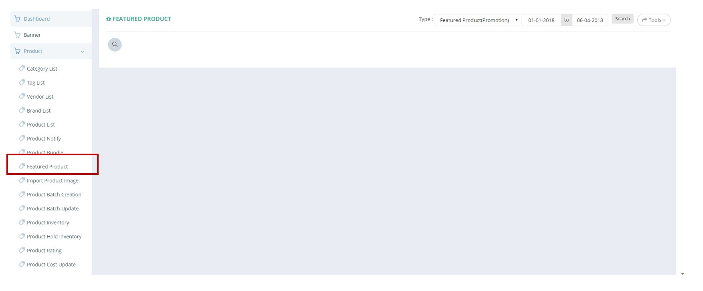
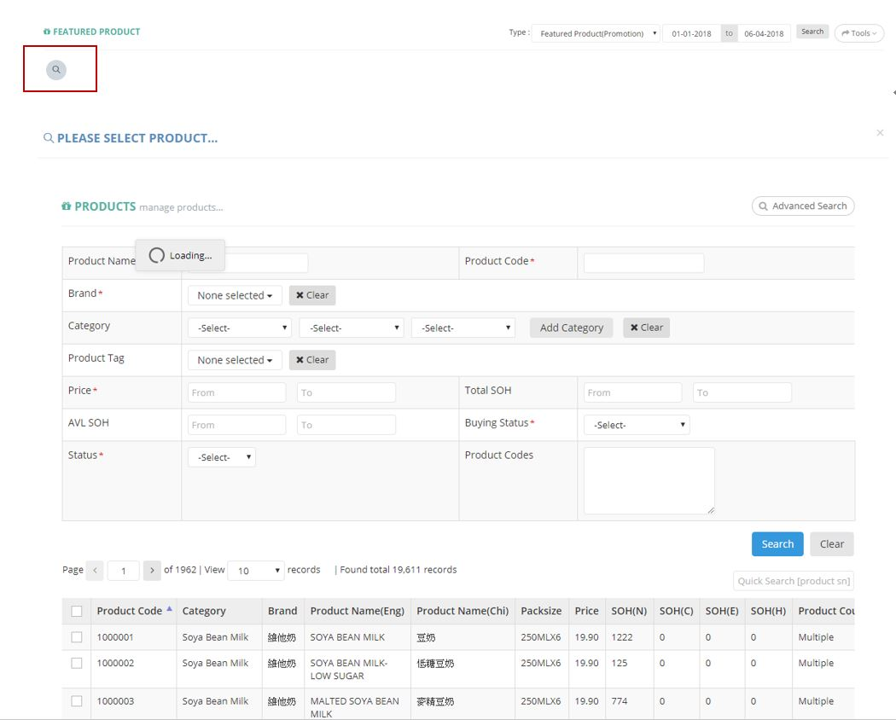

************
Featured Product Module 
************
Feature Product Module displays Featured Products within a specific Time Range specified by the Users.

|Featuredproductmodule|

Search & Add Featured Products
==================  
User can click on the “Search Icon” to Search or Add New Featured Products by inputting Details or Selecting Target Feature Products.

|Searchaddfeaturedproducts|

.. list-table:: Search & Add Featured Product Page
    :widths: 10 50
    :header-rows: 1
    :stub-columns: 1

    * - FIELD NAME
      - FIELD DESCRIPTION
    * - Product Name
      - The Featured Product Name
    * - Product Code
      - The Featured Product ID
    * - Brand
      - Select The Brand of Featured Product
    * - Category
      - The Featured Product Category
    * - Product Tag
      - The Tag of Featured Product
    * - Price
      - The Range of Product Price
    * - Total SOH
      - The Total Stock on Hold of Product
    * - AVL SOH
      - 
    * - Buying Status
      - this field is control by buyer. Delete: buyer want to delete this product, inactivation report will include this product and system auto inactive this item if out of stock Discontinue: like Delete, inactivation report will include this product and system auto inactive this item if out of stock OOS: mark this item as out of stock Pending: pending to activate this product
    * - Status
      - The Product Status (Active/ Inactive)
    * - Product Codes
      - The Featured Product Codes

