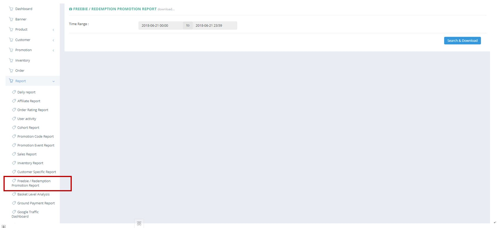
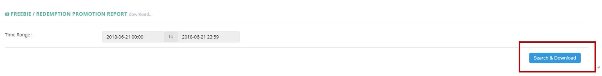

************
Freebie/Redemption Promotion Report Module
************
Freebie/ Redemption Promotion Report allows users to extract the Freebie and Redemption Promotion Data by specifying the Time Range.

|Freebieredemptionmodule|

.. list-table:: Freebie/Redemption Promotion Report Module Page
    :widths: 10 50
    :header-rows: 1
    :stub-columns: 1

    * - FIELD NAME
      - FIELD DESCRIPTION
    * - Time Range
      - The Date Range of Information to be Extracted for The Freebie/ Redemption Promotion Report

Freebie/Redemption Promotion Report
==================
User can Export Freebie and Redemption Promotion Data by clicking on the “Search & Download” button and specifying the Time Range of Data.

|Freebieredemptionreport|

.. list-table:: Freebie/Redemption Promotion Report Column Headings
    :widths: 10 50
    :header-rows: 1
    :stub-columns: 1

    * - FIELD NAME
      - FIELD DESCRIPTION
    * - Promotion ID
      - The Promotion ID
    * - Promotion title
      - The Promotion Title
    * - Freebie / Redeem product code
      - The Promotion Code
    * - Unit cost
      - The Promotion Product Unit Cost
    * - QTY
      - The Quantity of Promotion Product Ordered

