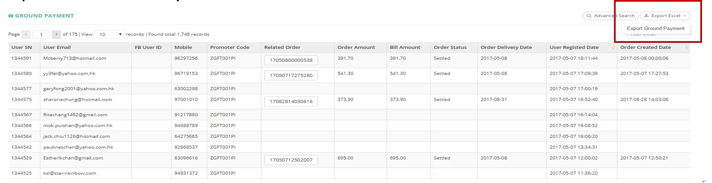

************
Ground Payment Report Module 
************
Ground Payment Module displays the Ground Payment Details of Different Customers and Order.

|Groundpaymentmodule|

.. list-table:: Ground Payment Report Module 
    :widths: 10 50
    :header-rows: 1
    :stub-columns: 1

    * - FIELD NAME
      - FIELD DESCRIPTION
    * - Time Range
      - The Date Range of Information to be Extracted for The Basket Level Analysis
    * - User SN
      - The Customer ID
    * - User Email
      - The Email of Customer
    * - FB User ID
      - The Facebook ID of Customer
    * - Mobile
      - The Mobile Phone Number of Customer
    * - Promoter Code
      - The Promoter Code in Ground Payment
    * - Related Order
      - The Related Order of Ground Payment
    * - Order Amount
      - The Total Order Amount of The Customer Order
    * - Bill Amount
      - The Billing Amount of The Customer Order
    * - Order Status
      - The Status of Customer Order
    * - Order Delivery Date
      - The Date of Order Delivery
    * - User Registered Date
      - The Register Date of Customer Account
    * - Order Created Date
      - The Date of Creating The Order by The Customer
      

Advanced Search
==================
User can Search Ground Payment Items by clicking on the “Advanced Search” button on top of the Ground Payment Table and input search criterion into the popup window.

|Groundpaymentadvancedsearch|

.. list-table:: Ground Payment Advanced Search Page 
    :widths: 10 50
    :header-rows: 1
    :stub-columns: 1

    * - FIELD NAME
      - FIELD DESCRIPTION
    * - User Registered Time
      - The Register Date Range of Customer Account
    * - Order Created Time
      - The Date Range of Creating The Order by The Customer
      
      
Ground Payment Report
==================

|Groundpaymentreport|

.. list-table:: Ground Payment Report Column Headings
    :widths: 10 50
    :header-rows: 1
    :stub-columns: 1

    * - FIELD NAME
      - FIELD DESCRIPTION
    * - User SN
      - The Customer ID
    * - User Email
      - The Customer Email
    * - FB User Id
      - The Mobile Number of The Customer
    * - Mobile
      - The Mobile Number of The Customer
    * - Promotioner Code
      - The Promotion Code Used by The Customer
    * - Related Order
      - The Related Order ID
    * - Order Amount
      - The Order Amount of The Related Order
    * - Bill Amount
      - The Billing Amount of The Related Order
    * - Order Status
      - Authorized/ Settled/ Refunded Order Status
    * - Order Delivery Date
      - The Date of Order Delivery
    * - User Created Date
      - The Date of Customer Account Created 
    * - Order Created Date
      - The Date of Order Created by The Customer
    * - Order Created Time
      - The Date Range of Creating The Order by The Customer
  
  

