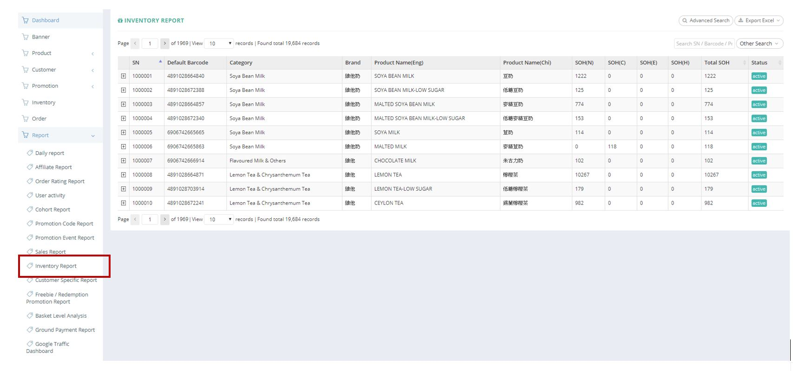
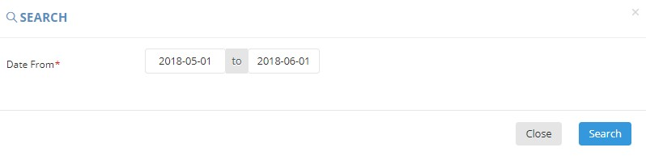
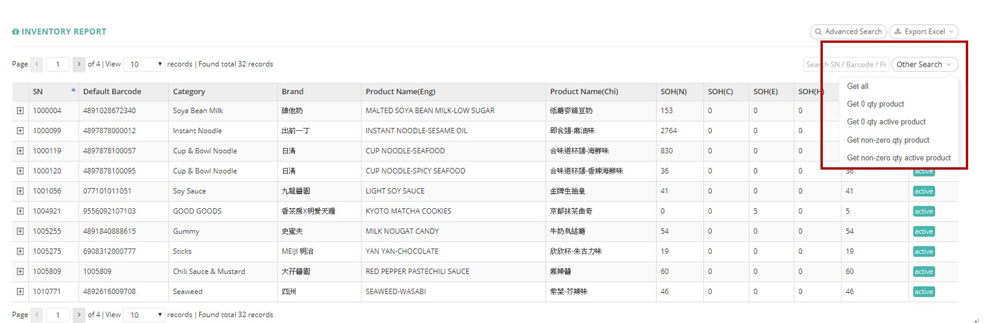
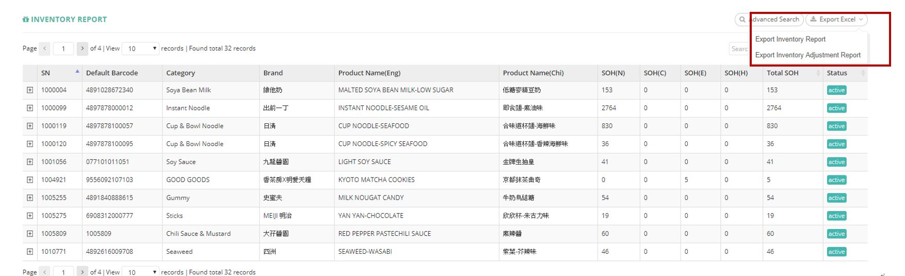

************
Inventory Report Module 
************
Inventory Report Module display the Inventory Details of different Products.

|Inventoryreportmodule|

.. list-table:: Inventory Report Module
    :widths: 10 50
    :header-rows: 1
    :stub-columns: 1

    * - FIELD NAME
      - FIELD DESCRIPTION
    * - SN
      - The Inventory ID
    * - Default Barcode
      - The Default Barcode of Inventory
    * - Category
      - The Category of Inventory
    * - Brand
      - The Brand of Inventory
    * - Product Name (Eng)
      - The Name of Product in English
    * - Product Name (Chi)
      - The Name of Product in Chinese
    * - SOH(N)
      - The fields state the normal stock on hand. Normal stock means that the best before date deducts min shelf day and deducts 10 days (for delivery process) is after today
    * - SOH(C)
      - The fields state the clearance stock on hand. Clearance stock means that the best before date between today plus 10 days (for delivery process) and today plus 10 days (for delivery process) plus min shelf day.
    * - SOH(E)
      - The fields state the expired stock on hand. Expired stock means that the best before date less than today plus 10 days (for delivery process). 
    * - SOH(H)
      - stock on hand - Hold
    * - Total SOH
      - sum of all stock on hand
    * - Status
      - Active/ Inactive Inventory

Advanced Search
==================
Users can Search the Inventory Details of different Products by Date Range when clicking on the “Advanced Search” button on top of the Inventory Report Table.

|Inventoryreportadvancedsearch|

.. list-table:: Inventory Report Advanced Search Page
    :widths: 10 50
    :header-rows: 1
    :stub-columns: 1

    * - FIELD NAME
      - FIELD DESCRIPTION
    * - Date From
      - The Date of Inventory within the Warehouse

Other Search
==================
Users can filter Inventory Details by Product Status and Product Inventory Quantity when clicking on the “Other Search” button on top of the Inventory Report Table.

|Inventoryreportothersearch|

.. list-table:: Inventory Report Module Other Search
    :widths: 10 50
    :header-rows: 1
    :stub-columns: 1

    * - FIELD NAME
      - FIELD DESCRIPTION
    * - Get all
      - Show all Product Inventory
    * - Get 0 qty product
      - Show Product with 0 Inventory
    * - Get 0 qty active product
      - Show "Active" Status Product with 0 Inventory
    * - get non-zero qty product
      - Show non-zero quantity Product
    * - get non-zero qty active product
      - Show "Active" Status non-zero quantity Product

Inventory Report
==================
User can Export Inventory Details in Excel Format by clicking on the “Export Excel” button on top of the Inventory Report Table.

|Inventoryreport|

.. list-table:: Inventory Report Column Headings
    :widths: 10 50
    :header-rows: 1
    :stub-columns: 1

    * - FIELD NAME
      - FIELD DESCRIPTION
    * - SN
      - The Product ID
    * - Category
      - The Product Category
    * - Brand
      - The Product Brand Name
    * - Product Name(Eng)
      - The English Product Name
    * - Product Name (Chi)
      - The Name of Product in Chinese
    * - SOH(N)
      - The fields state the normal stock on hand. Normal stock means that the best before date deducts min shelf day and deducts 10 days (for delivery process) is after today
    * - SOH(C)
      - The fields state the clearance stock on hand. Clearance stock means that the best before date between today plus 10 days (for delivery process) and today plus 10 days (for delivery process) plus min shelf day.
    * - SOH(E)
      - The fields state the expired stock on hand. Expired stock means that the best before date less than today plus 10 days (for delivery process). 
    * - SOH(H)
      - stock on hand - Hold
    * - Total SOH
      - sum of all stock on hand
    * - Status
      - Active/ Inactive Product Inventory
    * - get non-zero qty product
      - Show non-zero quantity Product
    * - get non-zero qty active product
      - Show "Active" Status non-zero quantity Product

