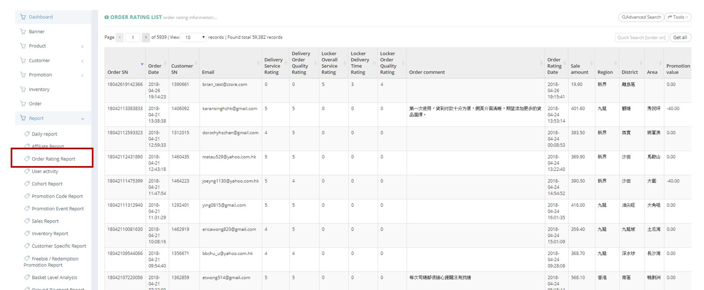
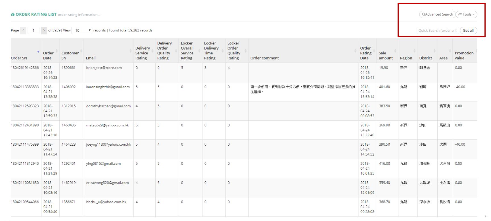
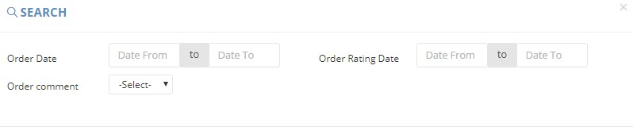
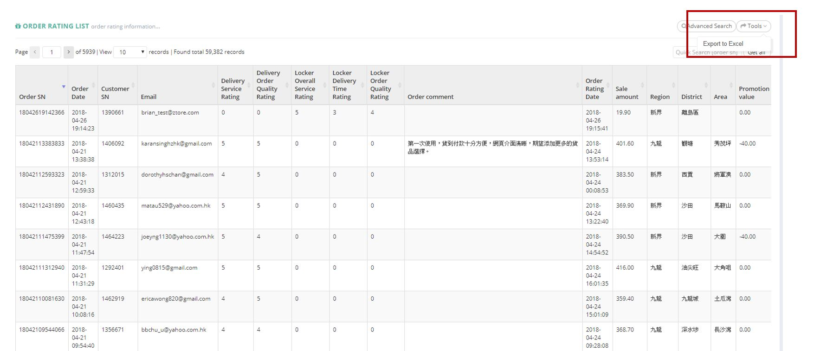

************
Order Rating Report Module 
************
Order Rating Report Module displays the Rating Details by Customer according to the Orders they made. 

|Orderratingreportmodule|

.. list-table:: Order Rating Report Module
    :widths: 10 50
    :header-rows: 1
    :stub-columns: 1

    * - FIELD NAME
      - FIELD DESCRIPTION
    * - Order SN
      - The Order ID
    * - Order Date
      - The Date of Order
    * - Customer SN
      - The Customer ID
    * - Email
      - The Email of Customer
    * - Delivery Service Rating
      - The Rating on Delivery Service Aspect of Order
    * - Delivery Order Quality Rating
      - The Rating on Delivery Order Quality Aspect of Order
    * - Locker Overall Service Rating
      - The Rating on Locker Overall Service Aspect of Order
    * - Locker Delivery Time Rating
      - The Rating on Locker Delivery Time Aspect of Order
    * - Locker Order Quality Rating
      - The Rating on Locker Order Quality Aspect of Order 
    * - Order comment
      - The comment on Order
    * - Order Rating Date
      - The Date of Customer Rated the Order
    * - Sale amount
      - The Sales Amount of Order
    * - Region
      - The Region of Order
    * - District
      - The District or Order
    * - Area
      - The Area of Order
    * - Promotion value
      - The Promotion Value of Order
      
Buttons
==================
Users can Search and Export Order Rating Details by clicking on the buttons on top of 
the Order Rating List.

|Orderratingbuttons|

.. list-table:: Order Rating Report Module Buttons
    :widths: 10 50
    :header-rows: 1
    :stub-columns: 1

    * - FIELD NAME
      - FIELD DESCRIPTION
    * - Advanced Search
      - Users can search with different criterion
    * - Tools
      - Users can Export Order Rating Details
    * - Quick Search Input Box
      - Users can quick search by inputting the Order ID into the Input Box
    * - Get all
      - Display All Order Rating Items

Advanced Search
==================
Users can Search Order Rating Items by clicking on the “Advanced Search” button on top of the Order Rating Table and inputting different criterion into the popup window.

|Orderratingadvancedsearch|

.. list-table:: Order Rating Report Advanced Search Page
    :widths: 10 50
    :header-rows: 1
    :stub-columns: 1

    * - FIELD NAME
      - FIELD DESCRIPTION
    * - Order Date
      - The Date Range of Order
    * - Order Rating Date
      - The Date Range of giving Ratings to the Order
    * - Order Comment 
      - Is There a Order Comment?
   
Order Rating Report
==================
Users can Export Order Rating Details in Excel Format by clicking on the “Export to Excel” Option from the “Tool” button dropdown list.

|Orderratingreport|

.. list-table:: Order Rating Report Column Headings
    :widths: 10 50
    :header-rows: 1
    :stub-columns: 1

    * - FIELD NAME
      - FIELD DESCRIPTION
    * - Order SN
      - The Order Serial Number(ID)
    * - Order Date
      - The Date of The Order
    * - Customer SN
      - The Customer ID
    * - Email
      - The Customer Email
    * - Friendliness Rating
      - The Rating of Friendliness Aspect of The Order by The Customer
    * - Appearance Rating
      - The Rating of Appearance Aspect of The Order by The Customer
    * - Ontime Rating
      - The Rating of Online Aspect of The Order by The Customer
    * - Accuracy Rating
      - The Rating of Accuracy Aspect of The Order by The Customer
    * - Situation Rating
      - The Rating of Friendliness Aspect of The Order by The Customer
    * - Delivery Service Rating
      - The Rating of Delivery Service Aspect of The Order by The Customer
    * - Delivery Order Quality Rating
      - The Rating of Delivery Order Quality Aspect of The Order by The Customer
    * - Locker Overall Service Rating
      - The Rating of Locker Overall Service Aspect of The Order by The Customer
    * - Locker Delivery Time Rating
      - The Rating of Locker Delivery Time Aspect of The Order by The Customer
    * - Locker Order Quality Rating
      - The Rating of Locker Order Quality Aspect of The Order by The Customer
    * - Order comment
      - The Comment of The Order
    * - Order Rating Date
      - The Date of Providing The Order Comments
    * - Sale amount
      - The Sales Amount of The Order
    * - Region
      - The Region of The Order
    * - District
      - The District of The Order
    * - Area
      - The Area of The Order
    * - Promotion value
      - The Promotion Value of The Order
   

