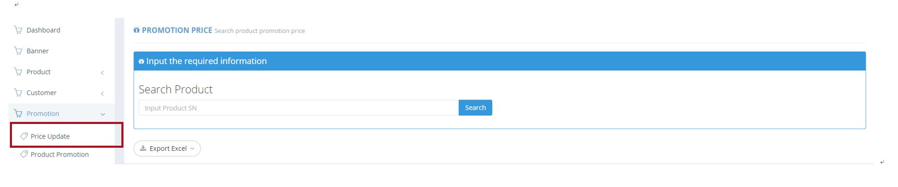
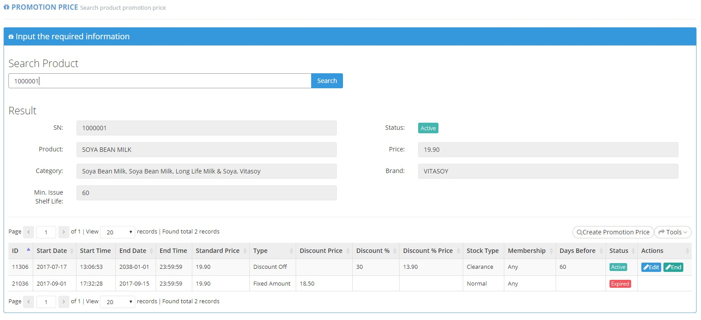
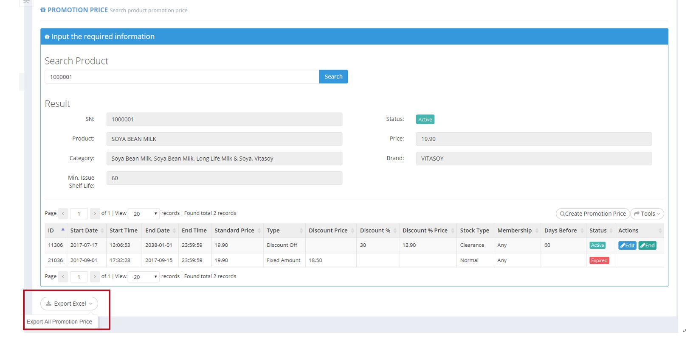

************
Price Update Module 
************
Users can search a Product by its Product SN (ID) to display the promotion price events of The Product.

|Priceupdatemodule|

.. list-table:: Price Update Module
    :widths: 10 50
    :header-rows: 1
    :stub-columns: 1

    * - FIELD NAME
      - FIELD DESCRIPTION
    * - Input Product SN
      - Input Product Serial Number(ID) here
      
      
After Searching The Product by its Product SN (ID), users can see the promotion price histories of The Product. Users can edit, create and remove the promotion price items.

|Priceupdatemodule2|

.. list-table:: Price Update Module Product Page Details
    :widths: 10 50
    :header-rows: 1
    :stub-columns: 1

    * - FIELD NAME
      - FIELD DESCRIPTION
    * - SN
      - The Product ID
    * - Status
      - The Product Status (Active/ Inactive)
    * - Product
      - The Product Name
    * - Price
      - The Standard Price of The Product
    * - Category
      - The Categories The Product belongs to
    * - Brand
      - The Product Brand
    * - Min. Issue Shelf Life
      - The Minimum Days before expiry date for Product to be Issued
    * - ID
      - The Promotion Price Item ID
    * - Start Date
      - The Promotion Price Item Starting Date
    * - Start Time
      - The Promotion Price Item Starting Time
    * - End Date
      - The Promotion Price Item Finishing Date
    * - End Time
      - The Promotion Price Item Finishing Time
    * - Standard Price
      - The Standard Price of The Price
    * - Type
      - The Promotion Type
    * - Discount Price
      - The Fixed Discounted Price of The Product
    * - Discount%
      - The Percentage of Discount off The Standard Price
    * - Discount % Price
      - The Percentage of Discount and The Standard Price of The Product
    * - Stock Type
      - The Stock Status of The Product having Promotion
    * - Membership
      - The Lowest Membership Tier to receive The Promotion
    * - Days Before
      - The days before "best before day" and have a discount to sell as clearance
    * - Status
      - The Product Promotion Price Item Status
    * - Action
      - Edit – Edit The Promotion Price Item Information, End – Stop The Promotion Price Item
      
      
Promotion Price Report
==================
Users can click the “Export Excel” to export all The Promotion Price Items of The Product in Excel Format.

|Promotionpricereport|

.. list-table:: Promotion Price Report Column Headings
    :widths: 10 50
    :header-rows: 1
    :stub-columns: 1

    * - FIELD NAME
      - FIELD DESCRIPTION
    * - Product SN
      - The Product ID
    * - Brand(Eng)
      - The English Product Brand Name
    * - Brand(Chi)
      - The Chinese Product Brand Name
    * - Product Name(Eng)
      - The English Product Name
    * - Product Name(Chi)
      - The Chinese Product Name
    * - Packsize
      - The Product Pack size
    * - Start
      - The Starting Date of The Promotion
    * - End
      - The Final Date of The Promotion
    * - Standard Price
      - The Standard Price of The Product
    * - Discount Type
      - The Type of Discount
    * - Discount Off
      - The Amount of Discount
    * - Promotion Price
      - The Promotion Price of The Product
    * - Stock Type
      - The Stock Type of The Product
    * - Membership Level
      - The Minimum Membership Rank to Obtain The Offer
    * - Days Before
      - The days before "best before day" and have a discount to sell as clearance
    * - Status
      - Active/ Expired Promotion
   
 
 

