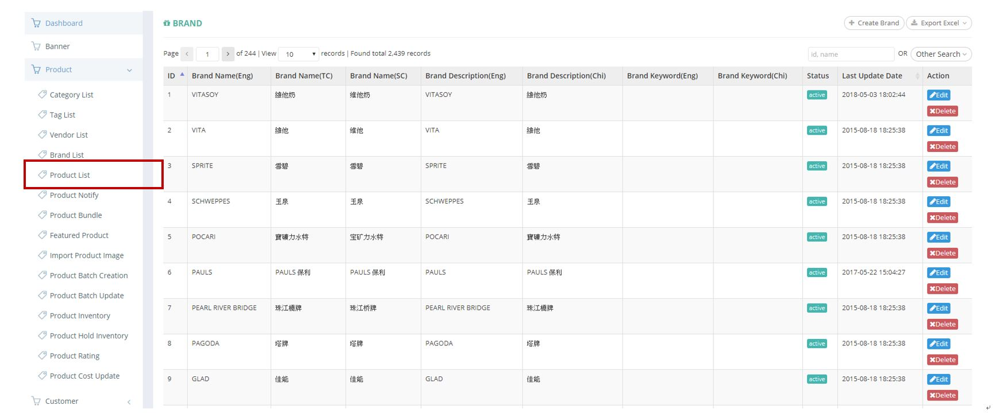
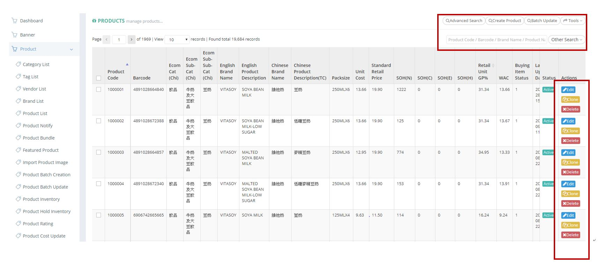
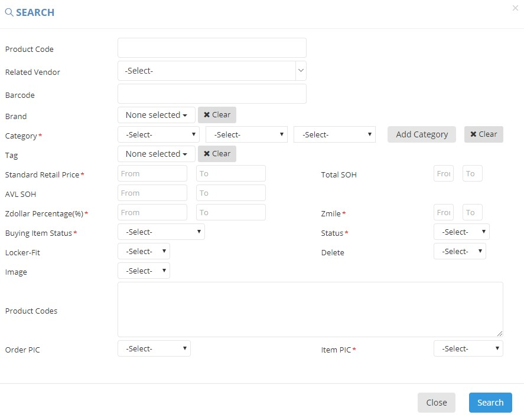

************
Product List Module 
************

Product List Module shows the details of different Products in the Table. User can create new Product items, search and export Product Details by clicking on the buttons on top of the Product List table. You can also edit and delete Product items by clicking on the corresponding buttons in the “Action” column.

|Productmodule|

.. list-table:: Product Module
    :widths: 10 50
    :header-rows: 1
    :stub-columns: 1

    * - FIELD NAME
      - FIELD DESCRIPTION
    * - Product Code
      - The Product Code
    * - Barcode
      - The Product Barcode
    * - Ecom Cat(Chi)
      - The first layer of category
    * - Ecom Sub-cat(Chi)
      - The second layer of category
    * - Ecom Sub-Sub-Cat(Chi)
      - The third layer of category
    * - English Brand Name
      - The Brand of Product in English
    * - English Product Description
      - The Description of Product in English
    * - Chinese Brand Name
      - The Brand of Product in Chinese
    * - Chinese Product Description(TC)
      - The Description of Product in Traditional Chinese
    * - Pack size
      - The Pack size of Product
    * - Unit Cost
      - The Cost per Unit of Product
    * - Standard Retail Price
      - The Standard price of Product
    * - SOH(N)
      - The fields state the normal stock on hand. Normal stock means that the best before date deducts min shelf day and deducts 10 days (for delivery process) is after today
    * - SOH(C)
      - The fields state the clearance stock on hand. Clearance stock means that the best before date between today plus 10 days (for delivery process) and today plus 10 days (for delivery process) plus min shelf day.
    * - SOH(E)
      - The fields state the expired stock on hand. Expired stock means that the best before date less than today plus 10 days (for delivery process).
    * - SOH(H)
      - stock on hand - Hold
    * - Retail Unit GP%
      - percentage of revenue
    * - WAC
      - The average cost of cost, it is affected by purchase order cost, discount, promotion credits
    * - Buying Item Status
      - It shows item status and is controlled by buying team
    * - Last Updated Date
      - The Last Updated Date of Product Information
    * - Photo
      - The Photo of the Product
    * - Delete
      - "Yes" or "No" for Deletion?
    * - Status
      - Active/ Inactive Products
    * - Actions
      - Edit/ Clone/ Delete Product Item
      
      
Buttons
==================
User can create and search Brand items by clicking on the buttons on top of the Brand table. User can also edit or delete individual Brand items by clicking on the corresponding buttons in the “Action” column.

|Productbuttons|

.. list-table:: Product Module
    :widths: 10 50
    :header-rows: 1
    :stub-columns: 1

    * - FIELD NAME
      - FIELD DESCRIPTION
    * - Advanced Search
      - User can search for Products with different Criterion
    * - Create Product
      - User can create new Product Item
    * - Batch Update
      - User can select more than one Product and edit details of those selected Products simultaneously
    * - Tools
      - Users can export different types of Product Reports
    * - Other Search
      - Users can filter Product items with their status
    * - Product Code/ Barcode/ Brand Name/ Product Name Input Box
      - Users can carry out quick search by inputting the Product’s Code/ Barcode/ Brand Name/ Name into the Input Box
   
Advanced Search
==================
Users can search for Product items by clicking on the “Advanced Search” buttons on top of the Products table and input different criterion in the popup window.

|Productadvancedsearch|

.. list-table:: Product Advanced Search
    :widths: 10 50 50
    :header-rows: 1
    :stub-columns: 1

    * - FIELD NAME
      - FIELD DESCRIPTION
      - CALCULATIONS
    * - Product Code
      - The Product Code
      -
    * - Related Vendor
      - The Product Vendor
      -
    * - Barcode
      - The Product Barcode
      -
    * - Brand
      - The Product Brand
      -
    * - Category
      - The Product Category
      -
    * - Tag
      - The Tag of The Product
      -
    * - Standard Retail Price
      - The Standard Retail Price Range of The Product
      -
    * - Total SOH
      - sum of all stock on hand
      - Normal + Clearance + Expired
    * - AVL SOH
      - stock on hand - available
      - Normal + Clearance - Hold (not include expired)
    * - Zdollar Percentage(%)
      - earn zdollar of percentage of sales value
      -
    * - Zmile
      - earn zmile if buy the product during a period, zmile is used for redeeming gift...
      -
    * - Buying Item Status
      - The Buying Item Issue for The Product or for Exchange
      - Delete - The Product is removed from Selling, Discontinue - The Product is stopped from Selling, OOS - The Product is Sold Out,         Pending - The Product is not yet Publicly Selling, Quality Issue - The Product is having Quality Problems currently, Ready - The         Product is Available for Selling, Return/Exchange - The Product is being Returned to The Vend
    * - Status
      - Active/ Inactive Products
      -
    * - Locker-Fit
      - "Yes" or "No" Fit into Locker
      -
    * - Delete
      - "Yes" or "No" Deleted Product
      -
    * - Product Codes
      - The Code of Products
      -
    * - Order PIC
      - The Person in Charge for The Product Order
      -
    * - Item PIC
      - The Person in Charge for The Product Item
      -
    

