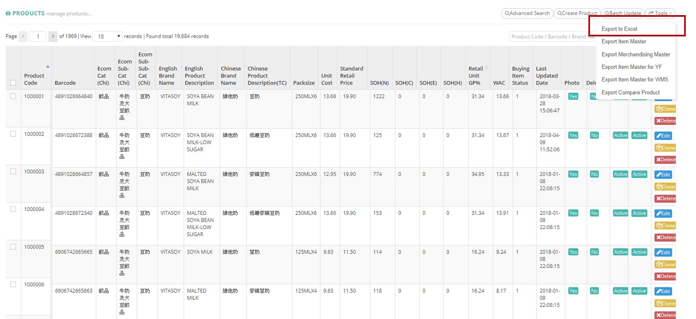
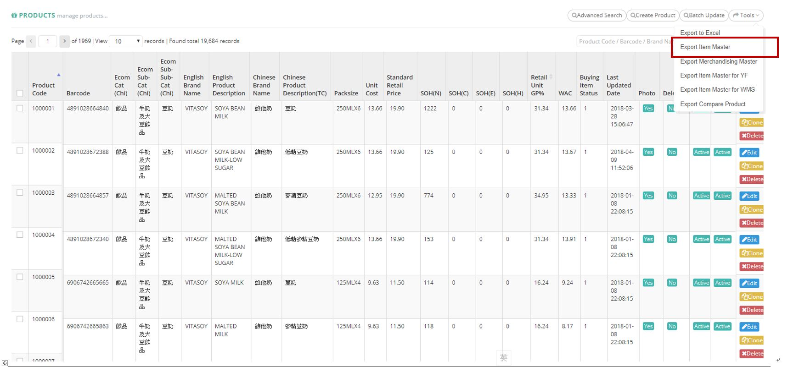
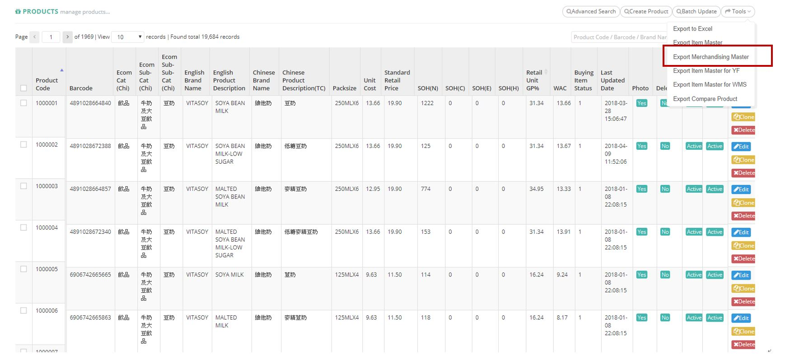
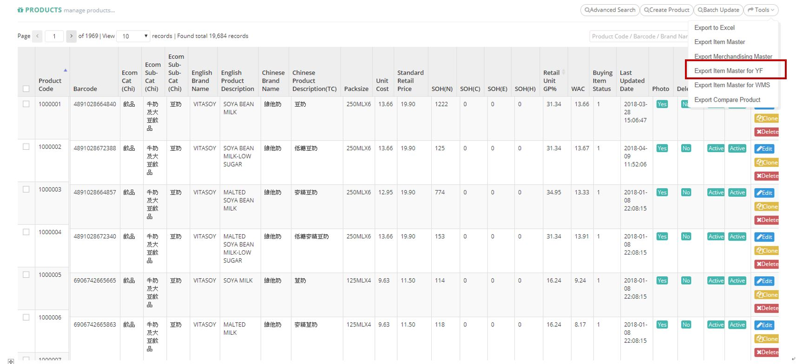
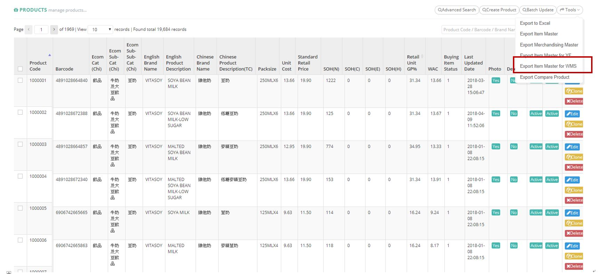
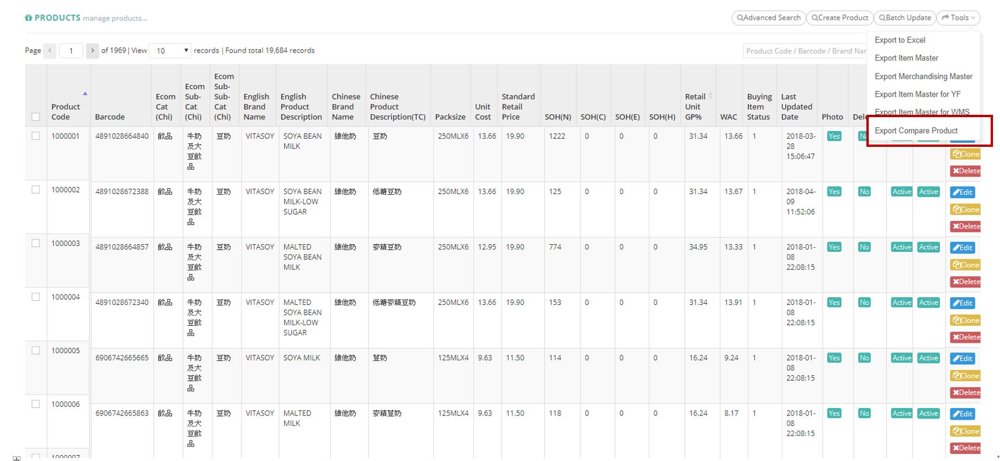

************
Product List Module 
************

Product List Module shows the details of different Products in the Table. User can create new Product items, search and export Product Details by clicking on the buttons on top of the Product List table. You can also edit and delete Product items by clicking on the corresponding buttons in the “Action” column.

|Productmodule|

.. list-table:: Product Module
    :widths: 10 50
    :header-rows: 1
    :stub-columns: 1

    * - FIELD NAME
      - FIELD DESCRIPTION
    * - Product Code
      - The Product Code
    * - Barcode
      - The Product Barcode
    * - Ecom Cat(Chi)
      - The first layer of category
    * - Ecom Sub-cat(Chi)
      - The second layer of category
    * - Ecom Sub-Sub-Cat(Chi)
      - The third layer of category
    * - English Brand Name
      - The Brand of Product in English
    * - English Product Description
      - The Description of Product in English
    * - Chinese Brand Name
      - The Brand of Product in Chinese
    * - Chinese Product Description(TC)
      - The Description of Product in Traditional Chinese
    * - Pack size
      - The Pack size of Product
    * - Unit Cost
      - The Cost per Unit of Product
    * - Standard Retail Price
      - The Standard price of Product
    * - SOH(N)
      - The fields state the normal stock on hand. Normal stock means that the best before date deducts min shelf day and deducts 10 days (for delivery process) is after today
    * - SOH(C)
      - The fields state the clearance stock on hand. Clearance stock means that the best before date between today plus 10 days (for delivery process) and today plus 10 days (for delivery process) plus min shelf day.
    * - SOH(E)
      - The fields state the expired stock on hand. Expired stock means that the best before date less than today plus 10 days (for delivery process).
    * - SOH(H)
      - stock on hand - Hold
    * - Retail Unit GP%
      - percentage of revenue
    * - WAC
      - The average cost of cost, it is affected by purchase order cost, discount, promotion credits
    * - Buying Item Status
      - It shows item status and is controlled by buying team
    * - Last Updated Date
      - The Last Updated Date of Product Information
    * - Photo
      - The Photo of the Product
    * - Delete
      - "Yes" or "No" for Deletion?
    * - Status
      - Active/ Inactive Products
    * - Actions
      - Edit/ Clone/ Delete Product Item
      
      
Buttons
==================
User can create and search Brand items by clicking on the buttons on top of the Brand table. User can also edit or delete individual Brand items by clicking on the corresponding buttons in the “Action” column.

|Productbuttons|

.. list-table:: Product Module
    :widths: 10 50
    :header-rows: 1
    :stub-columns: 1

    * - FIELD NAME
      - FIELD DESCRIPTION
    * - Advanced Search
      - User can search for Products with different Criterion
    * - Create Product
      - User can create new Product Item
    * - Batch Update
      - User can select more than one Product and edit details of those selected Products simultaneously
    * - Tools
      - Users can export different types of Product Reports
    * - Other Search
      - Users can filter Product items with their status
    * - Product Code/ Barcode/ Brand Name/ Product Name Input Box
      - Users can carry out quick search by inputting the Product’s Code/ Barcode/ Brand Name/ Name into the Input Box
   
Advanced Search
==================
Users can search for Product items by clicking on the “Advanced Search” buttons on top of the Products table and input different criterion in the popup window.

|Productadvancedsearch|

.. list-table:: Product Advanced Search
    :widths: 10 50 50
    :header-rows: 1
    :stub-columns: 1

    * - FIELD NAME
      - FIELD DESCRIPTION
      - CALCULATIONS
    * - Product Code
      - The Product Code
      -
    * - Related Vendor
      - The Product Vendor
      -
    * - Barcode
      - The Product Barcode
      -
    * - Brand
      - The Product Brand
      -
    * - Category
      - The Product Category
      -
    * - Tag
      - The Tag of The Product
      -
    * - Standard Retail Price
      - The Standard Retail Price Range of The Product
      -
    * - Total SOH
      - sum of all stock on hand
      - Normal + Clearance + Expired
    * - AVL SOH
      - stock on hand - available
      - Normal + Clearance - Hold (not include expired)
    * - Zdollar Percentage(%)
      - earn zdollar of percentage of sales value
      -
    * - Zmile
      - earn zmile if buy the product during a period, zmile is used for redeeming gift...
      -
    * - Buying Item Status
      - The Buying Item Issue for The Product or for Exchange
      - Delete - The Product is removed from Selling, Discontinue - The Product is stopped from Selling, OOS - The Product is Sold Out,         Pending - The Product is not yet Publicly Selling, Quality Issue - The Product is having Quality Problems currently, Ready - The         Product is Available for Selling, Return/Exchange - The Product is being Returned to The Vend
    * - Status
      - Active/ Inactive Products
      -
    * - Locker-Fit
      - "Yes" or "No" Fit into Locker
      -
    * - Delete
      - "Yes" or "No" Deleted Product
      -
    * - Product Codes
      - The Code of Products
      -
    * - Order PIC
      - The Person in Charge for The Product Order
      -
    * - Item PIC
      - The Person in Charge for The Product Item
      -
    
Create Products
==================
Users can create new Product items by clicking on the “Create Product” button on top of the Product table and input product details into the popup window.

|Createproducts|

.. list-table:: Create Products Page
    :widths: 10 50
    :header-rows: 1
    :stub-columns: 1
    
    * - FIELD NAME
      - FIELD DESCRIPTION
    * - Product Type
      - The Type of Product
    * - Product Code
      - Auto-Generation of The Code of Product by The System
    * - Barcode 1
      - The Product Barcode 1
    * - Barcode 2
      - The Product Barcode 2
    * - Barcode 3
      - The Product Barcode 3
    * - English Product Description
      - The English Description of Product
    * - Chinese Product Description(TC)
      - The Traditional Chinese Description of Product
    * - Chinese Product Description(SC)
      - The Simplified Chinese Description of Product
    * - SOH(N)
      - The fields state the normal stock on hand. Normal stock means that the best before date deducts min shelf day and deducts 10 days (for delivery process) is after today
    * - SOH(C)
      - The fields state the clearance stock on hand. Clearance stock means that the best before date between today plus 10 days (for delivery process) and today plus 10 days (for delivery process) plus min shelf day.
    * - SOH(E)
      - The fields state the expired stock on hand. Expired stock means that the best before date less than today plus 10 days (for delivery process).
    * - SOH(H)
      - stock on hand - Hold
    * - Photo
      - "Yes" or "No" Contain Photo
    * - Quota Per Order
      - The Upper Limit of Product Quantity in each Order
    * - Standard Retail Price
      - The Standard Retail Price of Product
    * - Zdollar Percentage(%)
      - earn zdollar of percentage of sales value
    * - Zdollar Start At
      - The Starting Date of Using available Zdollar
    * - Zdollar End At
      - The Final Date of Using available Zdollar
    * - Zmile
      - earn zmile if buy the product during a period, zmile is used for redeeming gift...
    * - Zmile Start At
      - The Starting Date of Using available Zmile
    * - Zmile End At
      - The Final Date of Using available Zmile
    * - Brand
      - The Brand of Product
    * - Product Unit
      - The Unit of Product
    * - Product Country
      - The Origin Country of Product
    * - New
      - Select if The Product is a "New" Item
    * - Hot
      - Select if The Product is a "Hot" Item
    * - Sort Order
      - The Relative Importance of The Product
    * - Buying Item Status
      - The Status of Product Buying Item
    * - Locker-Fit Exception
      - methods for deciding whether is locker fit, default => base on dimension, Yes => locker fit, No => non-locker fit 
    * - Locker-Fit
      - "Yes" or "No" Fit into Locker
    * - Visible
      - "Yes" or " No" Product Visibility
    * - Status
      - Active/ Inactive Product
    * - Active date
      - The date this product first time to be active
    * - Category
      - The Category Assigned to The Product
    * - Tag
      - The Tag of The Product
    * - Order PIC
      - The Person in Charge of The Product Order
    * - Item PIC
      - The Person in Charge of The Product Item
    * - Created Date
      - The Date of Creating The Product Item
    * - Created By
      - The Person of Creating The Product Item
    * - Updated Date
      - The Latest Date of Product Update
    * - Updated By
      - The Person of doing The Latest Update on The Product
    
Create Products - Product Other Information
------------------
Users can input the additional inventory and storage information into the session of “Product Other Information” which is in the lower part of Create Product popup window.

|Createproductsproductotherinformation|

.. list-table:: Create Products Product Other Information Page
    :widths: 10 50
    :header-rows: 1
    :stub-columns: 1
    
    * - FIELD NAME
      - FIELD DESCRIPTION
    * - Packsize
      - The number of Product Units in a Pack
    * - Packsize(Chi)
      - The Chinese number of Product Units in a Pack
    * - Retail Unit GP%
      - percentage of revenue
    * - WAC
      - Average of product cost
    * - No. of Retail Unit/Order UOM
      - The number of retail unit of order UOM
    * - No. of Retail Unit/Full Case
      - The number of retail unit of full case
    * - Manufacture Shelf Life 
      - The best before date should be produce date plus days of manufacture shelf life
    * - Service Level
      - The value that control how aggressive to keep inventory will not come to zero
    * - Minimum Inventory Warning
      - The Lower Limit of Inventory Level Triggering Inventory Warning
    * - Maximum Inventory Warning
      - The Upper Limit of Inventory Level Triggering Inventory Warning
    * - Min Receive Shelf Life
      - The Lower Limit of Placing The Product on Shelf Upon Receiving
    * - Min Issue Shelf Life
      - The Lower Limit of Placing The Product on Shelf Upon Issuing
    * - Link of Hktvmall Product Page
      - The Link of Product in HKTVMall
    * - Link of Parknshop Product Page
      - The Link of Product in Parknshop Page

Create Products - Product Detail
------------------
Users can input the additional Production introduction and keyword into the session of “Product Detail” which is in the lower part of Create Product popup window.

|Createproductsproductdetail|

.. list-table:: Create Products Product Detail Page
    :widths: 10 50
    :header-rows: 1
    :stub-columns: 1

    * - FIELD NAME
      - FIELD DESCRIPTION
    * - Product Intro.(Eng)
      - The English Introduction of The Product
    * - Product Intro.(Chi)
      - The Chinese Introduction of The Product
    * - Product Keyword(Eng)
      - The English Keyword of The Product
    * - Product Keyword(Chi)
      - The Chinese Keyword of The Product
      
Create Products - Product Vendor
------------------
Users can input the additional Production Vendor information into the session of “Product Vendor” which is in the lower part of Create Product popup window.

|Createproductsproductvendor|

.. list-table:: Create Products Product Vendor Page
    :widths: 10 50
    :header-rows: 1
    :stub-columns: 1
    
    * - FIELD NAME
      - FIELD DESCRIPTION
    * - Add Vendor
      - Users can click the “Add Vendor” button to input Vendor details.
    * - Default
      - Set the Vendor to the default Vendor of The Product
    * - Id
      - The Vendor ID
    * - Vendor Name
      - The Vendor Name
    * - Order UOM
      - The Unit of Product Ordering 
    * - Order UOM Cost
      - The Cost per Product Ordering Unit
    * - Full Case Cost
      - The Standard Cost of Standard Ordering Unit
    * - Discount Rate(%)
      - The Discount Rate for Ordering by Ztore
    * - Net Order UOM
      - The number of retail unit of order UOM
    * - Unit Cost
      - The Product Unit Cost
    * - Min. Order Quantity
      - The Minimum Product Order Quantity
    * - Actions
      - Cancel adding the Vendor item
   
Create Products - Product Image
------------------
Users can input the Product Image into the session of “Product Image” which is in the lower part of Create Product popup window.

|Createproductsproductimage|

.. list-table:: Create Products Product Image Page
    :widths: 10 50
    :header-rows: 1
    :stub-columns: 1
    
    * - FIELD NAME
      - FIELD DESCRIPTION
    * - Product Image 1
      - Upload The Product Image here
    * - Product Image 2
      - Upload The Product Image here
    * - Product Image 3
      - Upload The Product Image here
      
      
Create Products - Product Logistics
------------------
Users can input the Product logistic information into the session of “Product Logistics” which is in the lower part of Create Product popup window.

|Createproductsproductlogistics|

.. list-table:: Create Products Product Logistics Page
    :widths: 10 50
    :header-rows: 1
    :stub-columns: 1
    
    * - FIELD NAME
      - FIELD DESCRIPTION
    * - Relabel
      - "Yes" or "No" Relabeling of The Product?
    * - BBD Labeling Requirement:
      - How to label the best before date for this product
    * - Repackaging Requirement
      - Select The Requirement of Repackaging
    * - Temperature
      - The Temperature Level for Product Logistics
    * - Product Status
      - Select The Characteristics of The Product
    * - Expired Date Remark
      - Remarks on expired date. For example, some products assume that they will not be expired, we will mark as 20991231
    * - HS Code
      - Harmonized System Codes, use for custom clearance

Create Products - Product Dimension
------------------
Users can input the Product Dimension and Size information into the session of “Product Dimension” which is in the lower part of Create Product popup window.

|Createproductsproductdimension|

.. list-table:: Create Products Product Dimension Page
    :widths: 10 50
    :header-rows: 1
    :stub-columns: 1
    
    * - FIELD NAME
      - FIELD DESCRIPTION
    * - Case Length(cm)
      - The Length of Product Case
    * - Case Width(cm)
      - The Width of Product Case
    * - Case Height(cm)
      - The Height of Product Case
    * - Case Weight(g)
      - The Weight of Product Case
    * - Unit Length(cm)
      - The Length of a Product Unit
    * - Unit Width(cm)
      - The Width of a Product Unit
    * - Unit Height(cm)
      - The Height of a Product Unit
    * - Unit Weight(g)
      - The Weight of a Product Unit
    * - No. of CS per Pallet
      - Number of case size for each pallet
    * - No. of Layers per Pallet
      - Number of layer for each pallet
    * - No. of Cases per Layer
      - Number of case size for each layer

Batch Update
==================
Users can select more than one Product at a time and click the “Batch Update” button on top of the Products table to update the details of the selected Products at the same time.

|Productbatchupdate|

Other Search
==================
User can filter the Products by the Product stats when clicking the “Other Search” button on top of the Product table.

|Productothersearch|

.. list-table:: Product Other Search 
    :widths: 10 50
    :header-rows: 1
    :stub-columns: 1
    
    * - FIELD NAME
      - FIELD DESCRIPTION
    * - Get Inventory Warning Product
      - Display The Products with Inventories Reaching the Warning Level
    * - Get All
      - Show All Products
    * - Get Non-Delete Product
      - Show Products with Delete Field is "No"
  
Product Report
==================  
Users can export Product Details in Excel format by clicking on the “Export to Excel” options from the “Tools” button dropdown list on top of the Products table.

|Productreport|

.. list-table:: Product Report Column Headings 
    :widths: 10 50
    :header-rows: 1
    :stub-columns: 1
    
    * - FIELD NAME
      - FIELD DESCRIPTION
    * - Item No
      - The Product ID
    * - Barcode
      - The Product Barcode
    * - Ecom Cat (Chi)
      - The first layer of category
    * - Ecom Sub-Cat (Chi)
      - The second layer of category
    * - Ecom Sub-Sub-Cat (Chi)
      - The third layer of category
    * - English Brand Name
      - The English Brand Name of The Product
    * - English Product Description
      - The English Description of The Product
    * - Chinese Brand Name
      - The Chinese Brand Name of The Product
    * - Chinese Product Description
      - The Chinese Description of The Product
    * - Packsize
      - The Product Pack size
    * - Unit Cost
      - The Cost of Product Per Unit
    * - Standard Retail Price
      - The Standard Retail Price of The Product
    * - SOH(N)
      - The fields states the normal stock on hand. Normal stock means that the best before date deducts min shelf day and deducts 10 days (for delivery process) is after today
    * - SOH(C)
      - The fields states the clearance stock on hand. Clearance stock means that the best before date between today plus 10 days (for delivery process) and today plus 10 days (for delivery process) plus min shelf day.
    * - SOH(E)
      - The fields states the expired stock on hand. Expired stock means that the best before date less than today plus 10 days (for delivery process).
    * - SOH(H)
      - stock on hand - Hold
    * - Retail Unit GP%
      - percentage of revenue
    * - Buying Item Status
      - It shows item status and is controlled by buying team
    * - Last Updated Date
      - The Latest Update Date of The Product
    * - Photo
      - The Product Photo
    * - Status
      - Active/ Inactive Product
    * - Weighted Average Cost
      - The Weighted Average Cost of The Product

Product Item Master Report
================== 

Users can Export the Details of Different Product Items by clicking on the “Export Item Master” Option in the Dropdown list from the “Tools” button on top of the Product table.

|Productitemmasterreport|

.. list-table:: Product Item Master Report Column Headings 
    :widths: 10 50
    :header-rows: 1
    :stub-columns: 1
    
    * - FIELD NAME
      - FIELD DESCRIPTION
    * - Item No
      - The Product ID
    * - Barcode
      - The Product Barcode
    * - English Brand Name
      - The English Brand Name of The Product
    * - English Product Description
      - The English Description of The Product
    * - Packsize
      - The Product Pack size
    * - Chinese Brand Name
      - The Chinese Brand Name of The Product
    * - Chinese Product Description
      - The Chinese Product Description
    * - Chinese Brand Name
      - The Chinese Brand Name of The Product
    * - Chinese Product Description
      - The Chinese Description of The Product
    * - Vendor code
      - The Vendor ID
    * - Vendor name
      - The Vendor Name
    * - Vendor item no
      - The Vender Item Number
    * - Order UOM
      - The Measurement Unit of The Product
    * - Order PIC
      - The Person in Charge for The Product Order
    * - Item PIC
      - The Person in Charge for The Product Item
    * - No. of Retail Unit per Order UOM
      - The Amount of Retail Unit in Each Product Order Unit
    * - Order UOM Gross Cost
      - The Cost of Each Product Order Unit
    * - Discount Rate
      - The Discount Rate of Each Product Order Unit
    * - Net Order UOM Cost
      - The net cost of 1 UOM, UOM mean unit of measure
    * - Net Retail Unit Cost
      - The Net Cost of Each Product Retail Unit
    * - Weighted Average Cost
      - The Weighted Average Cost of Product per Unit
    * - Ecommerce Category (Primary)
      - The Primary Ecommerce Category of The Product\
    * - Ecom Cat (Eng)
      - The English Ecommerce Category of The Product
    * - Ecom Sub-Cat (Eng)
      - The English Sub-Ecommerce Category of The Product
    * - Ecom Sub-Sub-Cat (Eng)
      - The English Sub-Sub-Ecommerce Category of The Product
    * - Standard Retail Price
      - The Standard Retail Price of The Product
    * - Isactive
      - Active/ Inactive Product
    * - Buying Status
      - Ready/ Delete Buying Status
    * - Active Date
      - The Starting Date of Receiving Order 
    * - Ecommerce Category
      - The Ecommerce Category of The Product
    * - Tag
      - The Product Tag
    * - Chinese Product Introduction
      - The Chinese Introduction of The Product
    * - English Product Introduction
      - The English Introduction of The Product
    * - COO_ID
      - The country code of origin
    * - Relabel
      - Remind that this product need to handle relabel or not
    * - BBD
      - Special handling for BBD during inbound	
    * - Barcode Relabel
      - Remind that this product need to relabel barcode
    * - Expired Date Remark
      - The Additional Information of Product Expiry Date
    * - Min Receive Shelf Live
      - The Minimum Product Shelf Life Upon Revving
    * - Min Issue Shelf Live
      - The Minimum Product Shelf Life Upon Issuing
    * - Locker-Fit Exception
      - methods for deciding whether is locker fit, default => base on dimension, Yes => locker fit, No => non-locker fit 
    * - Case dimension-Length
      - The Product Case length
    * - Case dimension-Width
      - The Product Case Width
    * - Case dimension-Height
      - The Product Case Height
    * - Case weight
      - The Product Case Weight
    * - Unit dimension-Length
      - The Product Unit length
    * - Unit dimension-Width
      - The Product Unit Width
    * - Unit dimension-Height
      - The Product unit Height
    * - Unit weight
      - The Product Unit Weight
    * - Other Barcode
      - The Additional Barcode of The Product

Product Merchandising Master Report
================== 
Users can export the merchandizing details of different Products by clicking on the “Export Merchandising Mater” option from the “Tools” button dropdown list on top of the Products table.

|Productmerchandisingmasterreport|

.. list-table:: Product Merchandising Master Report Column Headings 
    :widths: 10 50
    :header-rows: 1
    :stub-columns: 1
    
    * - FIELD NAME
      - FIELD DESCRIPTION
    * - Product Code
      - The Product ID
    * - Barcode
      - The Product Barcode
    * - Ecommerce Category
      - The Ecommerce Category of The Product
    * - Ecommerce Category (Primary)
      - The Primary Ecommerce Category of The Product
    * - Ecom Cat (Eng)
      - The English Ecommerce Category of The Product
    * - Ecom Sub-Cat (Eng)
      - The English Sub-Ecommerce Category of The Productt
    * - Ecom Sub-Sub-Cat (Eng)
      - The English Sub-Sub-Ecommerce Category of The Product
    * - English Brand Name
      - The English Brand Name of The Product
    * - English Product Description
      - The English Description of The Product
    * - Chinese Brand Name
      - The Chinese Brand Name of The Product
    * - Chinese Product Description
      - The Chinese Description of The Product
    * - Packsize
      - The Product Pack size
    * - Vendor item no
      - The Vendor Item Number
    * - Vendor code
      - The Vendor ID
    * - Vendor name
      - The Vendor Name
    * - Primary Supplier
      - The Name of Primary Product Supplier
    * - Order UOM
      - The Measurement Unit of The Product Order
    * - No. of Retail Unit per Order UOM
      - The Amount of Retail Unit in Each Product Order Unit
    * - Full Case Gross Cost
      - The Gross Cost of Product per Full Case
    * - Discount Rate
      - The Discount Rate of The Product
    * - Net Order UOM Cost
      - The Net Cost of Each Product Order Unit
    * - Net Retail Unit Cost
      - The Net Cost of Each Product Retail Unit
    * - RSP
      - Means retail sales price, but it is useless now
    * - Standard Retail Price
      - The Standard Retail Price of The Product
    * - Retail Unit GP%
      - percentage of revenue
    * - COO_ID
      - The country code of origin
    * - Tag
      - The Product Tag
    * - Chinese Product Introduction
      - The Chinese Introduction of The Product
    * - English Product Introduction
      - The English Introduction of The Product
    * - Isactive
      - Is The Product active/inactive?t
    * - Buying Item Status
      - The fields state the normal stock on hand. Normal stock means that the best before date deducts min shelf day and deducts 10 days (for delivery process) is after today
    * - Active Date
      - The Active Date of The Product
    * - Photo Log Status
      - States this product exists product photos or not
    * - SOH(N)
      - The fields state the normal stock on hand. Normal stock means that the best before date deducts min shelf day and deducts 10 days (for delivery process) is after today
    * - RSOH(C)
      - The fields state the clearance stock on hand. Clearance stock means that the best before date between today plus 10 days (for delivery process) and today plus 10 days (for delivery process) plus min shelf day.
    * - SOH(E)
      - The fields state the expired stock on hand. Expired stock means that the best before date less than today plus 10 days (for delivery process).	
    * - SOH(H)
      - The Accumulated Product Sales Quantity
   

SKU Master Report
================== 
Users can export the stock keeping details of different Products by clicking on the “Export Item Master for YF” option from the “Tools” button dropdown list on top of the Products table.

|SKUMasterreport|
 
.. list-table:: SKU Master Report Column Headings 
    :widths: 10 50
    :header-rows: 1
    :stub-columns: 1
    
    * - FIELD NAME
      - FIELD DESCRIPTION
    * - ItemNo
      - The Product ID
    * - ItemDescription
      - The English Description of Th Product
    * - ItemDescriptionChi
      - The Chinese Description of The Product
    * - BarCode
      - The Product Barcode
    * - Barcode2
      - The Product Barcode
    * - Barcode3
      - The Product Barcode
    * - DefaultUOM
      - The Default Measurement Unit of The Product
    * - GrossWeight
      - The Gross Weight of The Product
    * - NetWeight
      - The Net Weight of The Product
    * - Length
      - The Length of The Product
    * - Width
      - The Width of The Product
    * - Height
      - The Height of The Product
    * - Cubage
      - represent product volume = length * width * height (all in meter)
    * - ColorCode
      - The Color-code of The Product
    * - SizeCode
      - The Size Code of The Product
    * - ItemCategory
      - The Product Category
    * - ItemCategoryChi
      - The Chinese Product Category
    * - ItemBrand
      - The Product Brand Name
    * - ItemBrandChi
      - The Chinese Product Brand Name
    * - ProductGroup
      - The Product Group of The Product Item
    * - VendorCode
      - The Vendor Code
    * - QtyForPallet
      - Capability for one pallet, use to estimate space during inbound
    * - PutawayStrategy
      - Rules for putaway, default is 1 item 1 location
    * - PickingStrategy
      - Rules for picking:FEFO, First Expired First Out, FIFO, First In First Out, FILO, First In Last Out
    * - PickByBatchNo
      - Use to control that this product need to pick by batch or not. If true, warehouse pickers need to pick items by given batch no for all sales orders
    * - PickByGoodsStatus
      - Control picking item status, but system have no control on this aspect
    * - MinShelfLife
      - The Minimum Shelf Life of The Product
    * - MinIssueShelfLife
      - The Minimum Shelf Life of The Product Upon Issuing
    * - IsStackable
      - Control item is stackable or not, but system have no control on this aspect
    * - IsDG
      - States is it a dangerous product
    * - DGNo
      - Number of dangerous goods
    * - HSCode
      - Harmonized System Codes, use for custom clearance
    * - ItemDescriptionCustoms
      - Item description for customs declaration in Simplified Chinese
    * - Specification
      - Seems pack size of goods
    * - CountryOfOrigin
      - The Country of Origin of The Product Item
    * - Currency
      - The Currency of Product Value	
    * - ItemValue
      - The Product Value
    * - MinInventoryWarning
      - The Minimum Inventory Amount for Warning
    * - Relable
      - Need to handle relabel or not
    * - BBDLabelRequirement
      - Best before day label requirement, use to remind how to label the best before date for this product
    * - Repackaging
      - Use to remind how to do repackaging such as barcode relabel, nutrient Label, plastics bag
    * - Fragile
      - Is fragile or not
    * - Perishable
      - Is perishable or not
    * - EasyLeak
      - Is it easy to leak or not
    * - EasyPollute
      - Is it easy to pollute or not
    * - BBDDisplayRemark
      - Use to remind how to input BBD in PDA
    * - IsCaringStorage
      - Is caring storage goods or not, such as put in air-conditioned environment
    * - IsHighValue
      - Is high value goods or not
    * - Specification_ZH_CN
      - Pack size in Simplified Chinese
    * - CountryOfOrigin_ZH_CN
      - The goods production country in Simplified Chinese
    * - UOM_ZH_CN
      - Measure unit in Simplified Chinese
    * - InnerQty
      - Quantity of inner pack
    * - InnerUOM_ZH_CN
      - Measure unit of inner pack in Simplified Chinese
    * - ItemBrand_ZH_CN
      - The goods brand in Simplified Chinese

WMS Item Report
================== 
Users can export the Warehouse Management details of different Products by clicking on the “Export Item Master for WMS” option from the “Tools” button dropdown list on top of the Products table.

|WMSItemreport|

.. list-table:: WMS Item Report Column Headings 
    :widths: 10 50
    :header-rows: 1
    :stub-columns: 1
    
    * - FIELD NAME
      - FIELD DESCRIPTION
    * - ItemNo
      - The Product ID
    * - ItemDescription
      - The English Description of The Product
    * - ItemDescriptionChi
      - The Chinese Description of The Product
    * - BarCode
      - The Product Barcode
    * - DefaultUOM
      - The Default Measurement Unit of The Product
    * - GrossWeight
      - The Gross Weight of The Product
    * - NetWeight
      - The Net Weight of The Product
    * - Length
      - The Length of The Product
    * - Width
      - The Width of The Product
    * - Height
      - The Height of The Product
    * - Cubage
      - represent product volume = length * width * height (all in meter)
    * - ItemCategory
      - The Product Category Name
    * - ItemCategoryChi
      - The Chinese Product Category Name
    * - ItemBrand
      - The Product Brand Name
    * - ItemBrandChi
      - The Chinese Product Brand Name
    * - QtyForPallet
      - Capability for one pallet, use to estimate space during inbound
    * - PickByBatchNo
      - Use to control that this product need to pick by batch or not. If true, warehouse pickers need to pick items by given batch no for all sales orders
    * - MinShelfLife
      - The Minimum Shelf Life of The Product
    * - MinIssueShelfLife
      - The Minimum Shelf Life of The Product Upon Issuing
    * - HSCode
      - Harmonized System Codes, use for custom clearance
    * - ItemDescriptionCustoms
      - Item description for customs declaration in Simplified Chinese
    * - Specification
      - Seems packsize of goods
    * - CountryOfOrigin
      - The Product Country of Origin
    * - Relable
      - Need to handle relabel or not
    * - BBDLabelRequirement
      - Best before day label requirement, use to remind how to label the best before date for this product
    * - Repackaging
      - Use to remind how to do repackaging such as barcode relabel, nutrient Label, plastics bag
    * - Fragile
      - Is fragile or not
    * - Perishable
      - Is perishable or not
    * - EasyLeak
      - Is it easy to leak or not
    * - BBDDisplayRemark
      - Use to remind how to input BBD in PDA	
    * - humidityAndTemperatureControl
      - is humidity and temperature control, such as put in air-conditioned environment
    * - IsHighValue
      - Is high value goods or not
    * - Specification_ZH_CN
      - Pack size in Simplified Chinese
    * - CountryOfOrigin_ZH_CN
      - The goods production country in Simplified Chinese
    * - UOM_ZH_CN
      - Measure unit in Simplified Chinese
    * - InnerQty
      - Quantity of inner pack
    * - InnerUOM_ZH_CN
      - Measure unit of inner pack in Simplified Chinese
    * - ItemBrand_ZH_CN
      - The goods brand in Simplified Chinese
    
Compare Product Report
================== 
Users can Compare Product details offered by Ztore and other companies when clicking on the “Export Item Master for WMS” option from the “Tools” button dropdown list on top of the Products table.

|Compareproductreport|

.. list-table:: Compare Product Report Column Headings 
    :widths: 10 50
    :header-rows: 1
    :stub-columns: 1
    
    * - FIELD NAME
      - FIELD DESCRIPTION
    * - Item No
      - The Product ID
    * - BarCode
      - The Product Barcode
    * - Ecom Cat (Chi)
      - The Chinese Ecommerce Category of The Product
    * - Ecom Sub-Cat (Chi)
      - The Chinese Sub-Ecommerce Category of The Product
    * - Ecom Sub-Sub-Cat (Chi)
      - The Chinese Sub-Sub-Ecommerce Category of The Product
    * - English Brand Name
      - The English Product Brand Name
    * - English Product Description
      - The English Product Description
    * - Chinese Brand Name
      - The Chinese Product Brand Name
    * - Chinese Product Description
      - The Chinese Product Brand Description
    * - Packsize
      - The Product Pack size
    * - Unit Cost
      - The Product Unit Cost
    * - Standard Retail Price
      - The Product Standard Retail Price
    * - SOH(N)
      - The fields states the normal stock on hand. Normal stock means that the best before date deducts min shelf day and deducts 10 days (for delivery process) is after today
    * - SOH(C)
      - The fields states the clearance stock on hand. Clearance stock means that the best before date between today plus 10 days (for delivery process) and today plus 10 days (for delivery process) plus min shelf day.
    * - SOH(E)
      - The fields states the expired stock on hand. Expired stock means that the best before date less than today plus 10 days (for delivery process).
    * - SOH(H)
      - The fields states the expired stock on hand. Expired stock means that the best before date less than today plus 10 days (for delivery process).
    * - Retail Unit GP%
      - percentage of revenue
    * - Buying Item Status
      - It shows item status and is controlled by buying team
    * - Last Updated Date
      - The Latest Date of Product Update
    * - Photo
      - Uploaded photo for the product?
    * - Status
      - product is active / inactive ?
    * - Compare Product Type
      - The Type of Comparing Product
    * - Compare Product Url
      - The Url Link of The Comparing Product
    * - Hktvamll Standard Price
      - The Standard Product Price in HKTVmall
    * - Hktvamll Price
      - The Current Product Price in HKTVmall
    * - hktvamll Product Name
      - The Product Name in HKTVmall
    * - Hktvamll PackingSpec
      - The Packing Specifics of The Product in HKTVmall
    * - Compare Product Type
      - The Type of Comparing Product
    * - Compare Product Url
      - The Url Link of The Comparing Product
    * - Parknshop Standard Price
      - The Standard Product Price in Parknshop	
    * - Parknshop Price
      - The Current Product Price in Parknshop
    * - Parknshop Product Name
      - The Product Name in Parknshop
    * - Parknshop PackingSpec
      - The Packing Specifics of The Product in Parknshop
    * - Parknshop OffAmount
      - The Discount Amount of The Product Item offered by Parknshop
   
      
.. |Productmodule| image:: Productmodule.JPG
.. |Productbuttons| image:: Productbuttons.JPG

.. |Createproductsproductdimension| image:: Createproductsproductdimension.jpg

