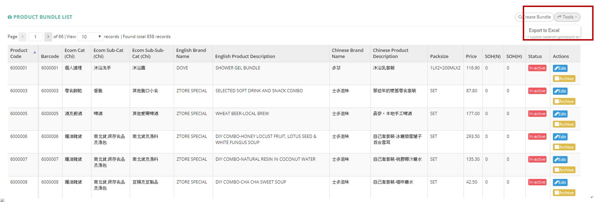

************
Product Bundle Module 
************
Product Bundle Module displays the details of all Product Bundles in the table. Users can create, search or export Product Bundle items in Excel format by clicking on the buttons on top of the able. Users can also edit and archive Product Bundle items by clicking the corresponding buttons in the “Actions” column.

|Productbundlemodule|

.. list-table:: Product Bundle Module
    :widths: 10 50
    :header-rows: 1
    :stub-columns: 1

    * - FIELD NAME
      - FIELD DESCRIPTION
    * - Product Code
      - The Product Code
    * - Barcode
      - The Product Barcode
    * - Ecom Cat(Chi)
      - The first layer of category
    * - Ecom Sub-cat(Chi)
      - The second layer of category
    * - Ecom Sub-Sub-Cat(Chi)
      - The third layer of category
    * - English Brand Name
      - The Name of Brand in English
    * - English Product Description
      - The Description of Brand in English
    * - Chinese Brand Name
      - The Name of Brand in Chinese
    * - Chinese Product Description
      - The Description of Product in Chinese   
    * - Packsize
      - The Pack size of Product
    * - Price
      - The Price of Product
    * - SOH(N)
      - The fields state the normal stock on hand. Normal stock means that the best before date deducts min shelf day and deducts 10 days (for delivery process) is after today
    * - SOH(H)
      - stock on hand - Hold
    * - Status
      - Active/ Inactive Product Bundle
    * - Actions
      - Edit - Edit Product Bundle Information, Archive - Archive Product Bundle Item Information

    
.. list-table:: 
 
Buttons
==================  
Users can click on the buttons on top of the Product Bundle table to create new Product Bundle Item and export Product Bundle details. Users can also carry out quick search by inputting Product Bundle code in the input box

|Productbundlebuttons|

.. list-table:: Product Notify Module Buttons
    :widths: 10 50
    :header-rows: 1
    :stub-columns: 1

    * - FIELD NAME
      - FIELD DESCRIPTION
    * - Create Bundle
      - Create a new set of Product Bundle Items
    * - Tools
      - Show All "Active" Status Notifications
    * - Quick Search Input Box
      - Users can input Product ID into the Input Box for quick search
    
   
.. list-table:: 

Create Product Bundle
================== 
Users can create new Product Bundle items by clicking on the “Create Bundle” button on top of the Product Bundle table.

|Createproductbundle|

.. list-table:: Product Notify Module Buttons
    :widths: 10 50
    :header-rows: 1
    :stub-columns: 1

    * - FIELD NAME
      - FIELD DESCRIPTION
    * - Bundle Parent
      - The Product Parent of The Bundle
    * - Bundle Childrens(Selection)
      - The Product Children of The Bundle
    * - Bundle Childrens(Text Phase)
      - "Use standard format data to add bundle children quickly, Format is ""item code"" ""qty"" each line, eg)1000002 2 1000003 3 System will added 1000002 X2 and 1000003 X3 into children list"

      
.. list-table:: 

Product Bundle Report
================== 
Users can export Product Bundle details in Excel format by clicking on the “Tools” button on top of the Product Bundle table.

|Productbundlereport|

.. list-table:: Product Bundle Report Column Headings
    :widths: 10 50
    :header-rows: 1
    :stub-columns: 1

    * - FIELD NAME
      - FIELD DESCRIPTION
    * - Bundle SN
      - The Product Bundle ID
    * - Bundle Name
      - The Product Bundle Name
    * - Packsize
      - The Product Bundle Pack size
    * - Unit Cost
      - The Product Bundle Cost per Unit
    * - Standard Retail Price
      - The Product Bundle Standard Retail Price
    * - Margin
      - The Product Bundle Profit Margin
    * - SOH
      - sum of all stock on hand
    * - SOH(H)
      - stock on hand - Hold
    * - Isactive
      - Is The Product Bundle active/ inactive
    * - Product SN
      - The Product ID
    * - Brand
      - The Product Brand
    * - Product Name
      - The Product Name
    * - Packsize
      - The Product Pack size
    * - Bundle Set Quantity
      - The bundle set consist of how many qty of this child, bundle set can consist of different goods
    * - Unit Cost
      - The Product Unit Cost
    * - Standard Retail Price
      - The Standard Retail Price of The Product
    * - Margin
      - The Product Profit Margin
    * - SOH
      - sum of all stock on hand
    * - SOH(H)
      - stock on hand - Hold
    * - Isactive
      - Is The Product Bundle active/ inactive
      
.. list-table:: 

