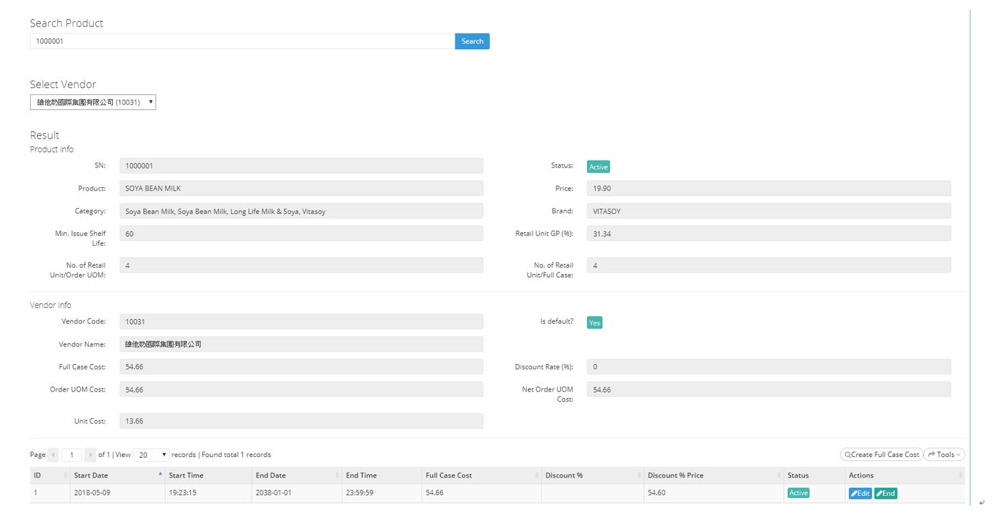

************
Product Cost Update Module 
************
Users can update the Cost Information of different Products by inputting the corresponding Product ID.

|Productcostupdate1|
|Productcostupdate2|

.. list-table:: Product Cost Update Module
    :widths: 10 50
    :header-rows: 1
    :stub-columns: 1

    * - FIELD NAME
      - User can input the Product ID of The Product to be Updated
    * - Search Product 
      - The Featured Product Name
    * - Select Vendor
      - Select the Product Vendor of the Product
    * - SN
      - The Product ID
    * - Status
      - The Product Status (Active/ Inactive)
    * - Product
      - The Product Name
    * - Price
      - The Range of Product Price
    * - Price
      - The Product Standard Price
    * - Category
      - The Categories The Product belongs to
    * - Brand 
      - The Product Brand
    * - Min. Issue Shelf Life
      - It controls how many days before that it will not sell in the front end. "eg) when min. issue shelf life = 45, Ztore will stop to sell this product if the best before day within 45 + 10 days (10 days is for delivery)"
    * - Retail Unit GP(%)
      - percentage of revenue
    * - No. of Retail Unit/ Order UOM
      - The number of retail unit of order UOM
    * - No. of Retail Unit/ Full Case
      - The number of retail unit of full case
    * - Vendor Code
      - The Vendor ID
    * - Is default
      - Whether The Vendor is the default supplier 
    * - Vendor Name
      - The Vendor Name
    * - Full Case Cost
      - The price of the case-size product
    * - Discount Rate (%)
      - The Discount Percentage offered to Customer
    * - Order UOM Cost
      - The Total Cost of a Order Unit of Product
    * - Net Order UOM Cost
      - The Net Cost of a Order Unit of Product
    * - Unit Cost
      - The Cost per Product Unit
    * - ID
      - The Product Promotion ID
    * - Start Date
      - The Starting Date of the Product Promotion Event
    * - Start Time
      - The Stating Time of the Product Promotion Event
    * - End Date
      - The Final Date of the Product Promotion Event
    * - End Time
      - The Final Time of the Product Promotion Event
    * - Full Case Cost
      - The Cost of a Entire Full Case of Product Items
    * - Discount %
      - The Discount Percentage
    * - Discount % Price
      - The Discounted Product Price
    * - Status
      - The Product Promotion Event Status
    * - Actions
      - Edit or End the Product Promotion Details 
   

