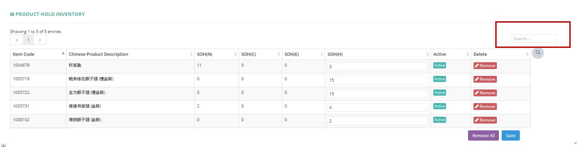

************
Product Hold Inventory Module 
************
Product Hold Inventory Module displays Stock Holding Numbers of different Products. Users can search Stock Holding information by putting any related details into the Input Box on top of the Product Hold Inventory table or remove the items by clicking on the corresponding buttons in the “Delete” column.

|Productholdinventory|

.. list-table:: Product Inventory Module
    :widths: 10 50
    :header-rows: 1
    :stub-columns: 1

    * - Item Code
      - The Product Code
    * - Chinese Product Description
      - The Chinese Description of Product
    * - SOH(N)
      - The fields state the normal stock on hand. Normal stock means that the best before date deducts min shelf day and deducts 10 days (for delivery process) is after today
    * - SOH(C)
      - The fields state the clearance stock on hand. Clearance stock means that the best before date between today plus 10 days (for delivery process) and today plus 10 days (for delivery process) plus min shelf day.
    * - SOH(E)
      - The fields state the expired stock on hand. Expired stock means that the best before date less than today plus 10 days (for delivery process).
    * - SOH(H)
      - stock on hand - Hold
    * - Active
      - Active/ Inactive Product Hold Inventory
    * - Delete
      - Remove Product Hold Inventory Item
      
      

