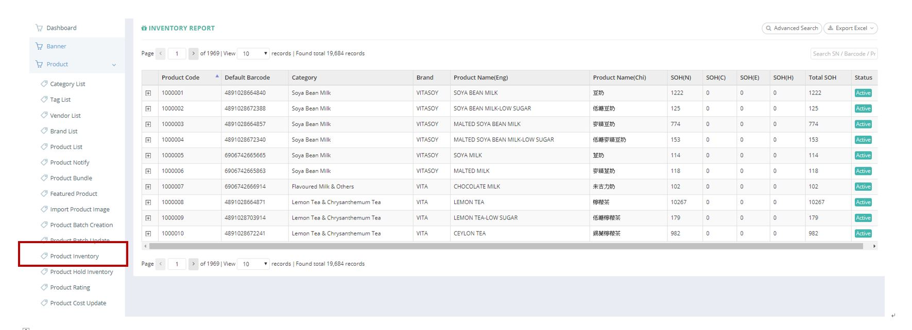
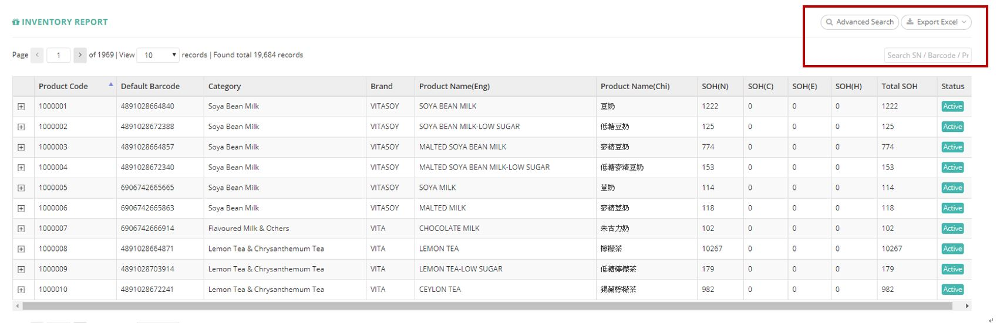
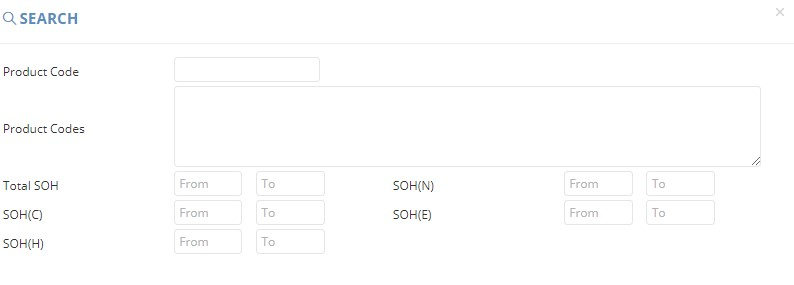
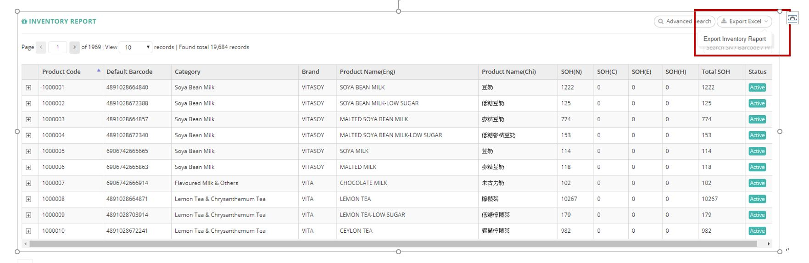

************
Product Inventory Module 
************
Product Inventory Module displays the Inventory details of different Products in a table. Users can Search or Export Inventory details of different products by clicking on the buttons on top of the Product Inventory table.

|Productinventorymodule|

.. list-table:: Product Inventory Module
    :widths: 10 50
    :header-rows: 1
    :stub-columns: 1

    * - FIELD NAME
      - FIELD DESCRIPTION
    * - Product Code
      - The Product Code
    * - Default Barcode
      - The Default Barcode of The Product
    * - Category
      - The Category of The Product
    * - Brand
      - The Product Brand
    * - Product Name(Eng)
      - The English Product Name
    * - Product Name(Chi)
      - The Chinese Product Name
    * - SOH(N)
      - The fields state the normal stock on hand. Normal stock means that the best before date deducts min shelf day and deducts 10 days (for delivery process) is after today
    * - SOH(C)
      - The fields state the clearance stock on hand. Clearance stock means that the best before date between today plus 10 days (for delivery process) and today plus 10 days (for delivery process) plus min shelf day.
    * - SOH(E)
      - The fields state the expired stock on hand. Expired stock means that the best before date less than today plus 10 days (for delivery process).
    * - SOH(H)
      - stock on hand - Hold
    * - Total SOH
      - sum of all stock on hand (Normal + Clearance + Expired)
    * - Status
      - Active/ Inactive Inventory

Buttons
==================  
Users can search and export Inventory details of different Products by clicking the buttons on top of the Product Inventory table.

|Productinventorybuttons|

.. list-table:: Product Inventory Module Buttons
    :widths: 10 50
    :header-rows: 1
    :stub-columns: 1

    * - FIELD NAME
      - FIELD DESCRIPTION
    * - Advanced Search
      - Users can search for Inventory details by different criterion
    * - Export Excel
      - Users can export Inventory Details of different Products 
    * - Search SN/ Barcode/ Product Name Input Box
      - User can carry out quick search by inputting the related values into the Input Box
   
Advanced Search
==================
Users can click on the “Advanced Search” button on top of the Product Inventory table and input different criterion into the popup window for locating the target Inventory Details.

|Productinventoryadvancedsearch|

.. list-table:: Product Inventory Advanced Search
    :widths: 10 50
    :header-rows: 1
    :stub-columns: 1

    * - FIELD NAME
      - FIELD DESCRIPTION
    * - Product Code
      - The Product Code
    * - Product Codes
      - The Product Codes of Products you search for 
    * - Total SOH
      - sum of all stock on hand (Normal + Clearance + Expired)
    * - SOH(N)
      - The fields states the normal stock on hand. Normal stock means that the best before date deducts min shelf day and deducts 10 days (for delivery process) is after today
    * - SOH(C)
      - The fields states the clearance stock on hand. Clearance stock means that the best before date bewteen today plus 10 days (for delivery process) and today pulus 10 days (for delivery process) plus min shelf day.
    * - SOH(E)
      - The fields states the expired stock on hand. Expired stock means that the best before date less than today plus 10 days (for delivery process).
    * - SOH(H)
      - stock on hand - Hold
      
Inventory Report
==================
Users can export Inventory details of different Products by clicking on the “Export Excel” button on top of the Product Inventory table.

|Productinventoryreport|

.. list-table:: Product Inventory Report Column Headings
    :widths: 10 50
    :header-rows: 1
    :stub-columns: 1

    * - FIELD NAME
      - FIELD DESCRIPTION
    * - Product Code
      - The Product ID
    * - Active
      - Active/ Inactive Product
    * - Vendor
      - The Product Vendor Name
    * - Order PIC
      - The Person in Charge for Product Order
    * - Item PIC
      - The Person in Charge for The Product Item
    * - Ecom Cat (Eng)
      - The English Ecommerce Product Category of The Product
    * - Ecom Sub-Cat (Eng)
      - The English Ecommerce Sub-Category of The Product
    * - Ecom Sub-Sub-Cat (Eng)
      - The English Ecommerce Sub-Sub-Category of The Product
    * - Chinese Brand
      - The Chinese Product Brand Name
    * - Chinese Product Name
      - The Chinese Product Name
    * - Packsize
      - The Product Pack size
    * - Net Cost
      - The Net Cost of The Product
    * - Standard Retail
      - The Standard Retail Price of The Product
    * - GP%
      - percentage of revenue
    * - SOH(N)
      - The fields state the normal stock on hand. Normal stock means that the best before date deducts min shelf day and deducts 10 days (for delivery process) is after today
    * - SOH(C)
      - The fields state the clearance stock on hand. Clearance stock means that the best before date between today plus 10 days (for delivery process) and today plus 10 days (for delivery process) plus min shelf day.
    * - SOH(E)
      - The fields state the expired stock on hand. Expired stock means that the best before date less than today plus 10 days (for delivery process).
    * - SOH(H)
      - stock on hand - Hold
    * - Total SOH
      - sum of all stock on hand (Normal + Clearance + Expired)
    * - Min. Issue Shelf Life
      - It controls how many days before that it will not sell in the front end. (eg) when min. issue shelf life = 45, Ztore will stop to sell this product if the best before day within 45 + 10 days (10 days is for delivery)
    * - Batch No.
      - Batch number for the product, format: PO number - item code - Best before date e.g. PO18060713320798-1000001-20190529
    * - Batch Qty
      - quantity for the batch record
    * - By Batch
      - By Batch
    * - Days to be Short Shelf
      - the product will become a short shelf after this days
    * - Promotion Price
      - The promotion price for this batch if there exists
   

