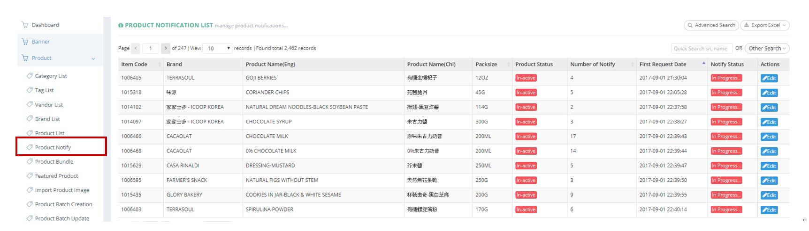
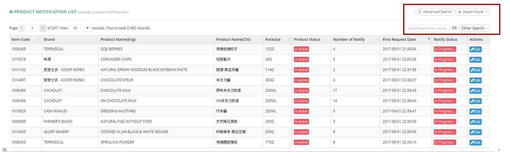
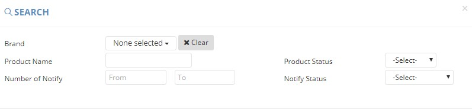
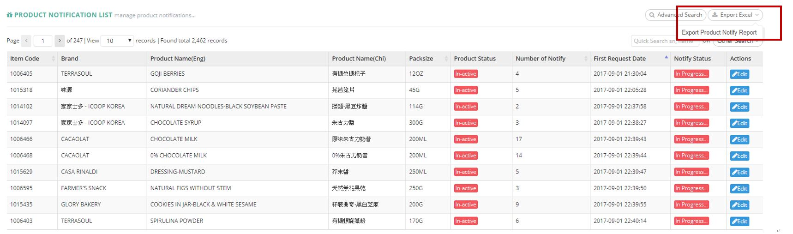
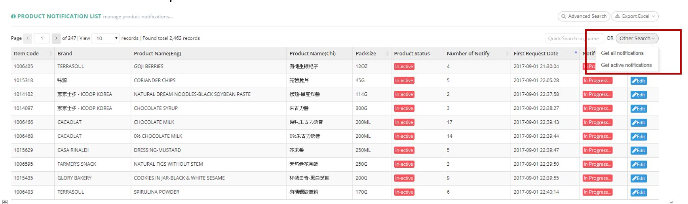

************
Product Notify Module 
************

Product Notification List displays the details of different Product Notification items. Users can search and export Product Notification details by clicking on the buttons on top of the Product Notification tables and edit the details by clicking on the corresponding “Edit” button in the “Action” column.

|Productnotifymodule|

.. list-table:: Product Notify Module
    :widths: 10 50
    :header-rows: 1
    :stub-columns: 1

    * - FIELD NAME
      - FIELD DESCRIPTION
    * - Item Code
      - The Product Code
    * - Brand
      - The Brand of Product
    * - Product Name(Eng)
      - The Name of Brand in English
    * - Product Name(Chi)
      - The Name of Brand in Chinese
    * - Packsize
      - The number of Product Units in a Pack
    * - Product Status
      - Active/ Inactive Product
    * - Number of Notify
      - The number that how many customers request replenishment notify
    * - First Request Date
      - The Date of First Product Request Notification
    * - Notify Status
      - Buyer Remarked/ Closed/ In Progress.../ Manually Closed Product Notification
    * - Actions
      - Edit - Edit Product Notification Item
      
      
Buttons
==================  
User can search Product Notification items by clicking on the buttons on top of the Product Notification table. User can also export Product Notification details in Excel format.

|Productnotifybutton|

.. list-table:: Product Notify Module Buttons
    :widths: 10 50
    :header-rows: 1
    :stub-columns: 1

    * - FIELD NAME
      - FIELD DESCRIPTION
    * - Advanced Search
      - Users can search Product Notification items with different criterion
    * - Export Excel
      - Users can export Product Notification details in Excel format
    * - Quick Search sn, name Input Box
      - Users can carry out quick search by inputting Product ID or Product Name into the Input Box
    * - Other Search
      - Users can filter Product Notifications by their status.
   
   
Advanced Search
==================
Users can click on the “Advanced Search” button on top of the Product Notification List and input different criterion in the popup window to search the targeted Product Notification.

|Productnotifyadvancedsearch|

.. list-table:: Product Notify Advanced Search Page
    :widths: 10 50 50
    :header-rows: 1
    :stub-columns: 1

    * - FIELD NAME
      - FIELD DESCRIPTION
      - DROPDOWN LIST
    * - Brand
      - The Product Brand
      -
    * - Product Name
      - The Product Name
      -
    * - Number of Notify
      - The Number Rage of Product Notification
      -
    * - Notify Status
      - Buyer Remarked/ Closed/ In Progress.../ Manually Closed Product Notification
      - Buyer Remarked - The Product Notification is Remarked by The Customer to Receive, Closed - The Product Notification is closed, In Progress... - The Product Notification is in the Progress of Notifying Customer, Manually Closed - 

Product Notify Report
==================
Users can export Product Notification items details in Excel format by clicking on the “Export Excel” button on top of the Product Notification table.

|Productnotifyreport|

.. list-table:: Product Notify Report Column Headings
    :widths: 10 50
    :header-rows: 1
    :stub-columns: 1

    * - FIELD NAME
      - FIELD DESCRIPTION
    * - Item Code
      - The Product ID
    * - Brand
      - The Product Brand
    * - Name(Eng)
      - The English Product Name
    * - Name(Chi)
      - The Chinese Product Name
    * - Packsize
      - The Product Pack size
    * - Product Status
      - Active/ Inactive Product
    * - Number of Notify
      - The Number of Product Notify of The Product
    * - First Request Date
      - The Date of First Product Notify for The Product
    * - Notify Status
      - The Product Notification Status
      
Other Search
==================
Users can filter Product Notification by their status when clicking on the “Other Search” button on top of the Production Notification table.

|Productnotifyothersearch|

.. list-table:: Product Notify Other Search
    :widths: 10 50
    :header-rows: 1
    :stub-columns: 1

    * - FIELD NAME
      - FIELD DESCRIPTION
    * - Get all notifications
      - Show All Notifications
    * - get active notifications
      - Show All "Active" Status Notifications
    

