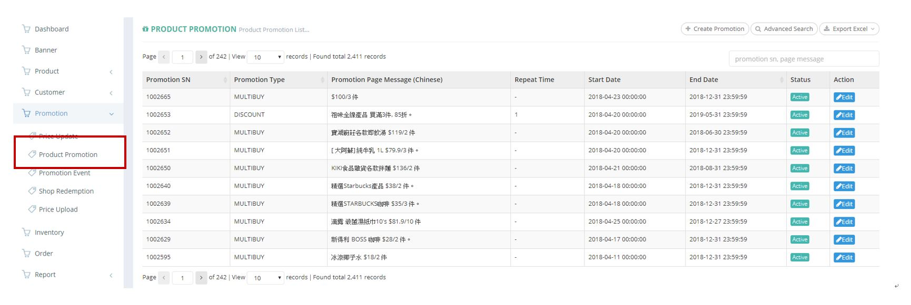
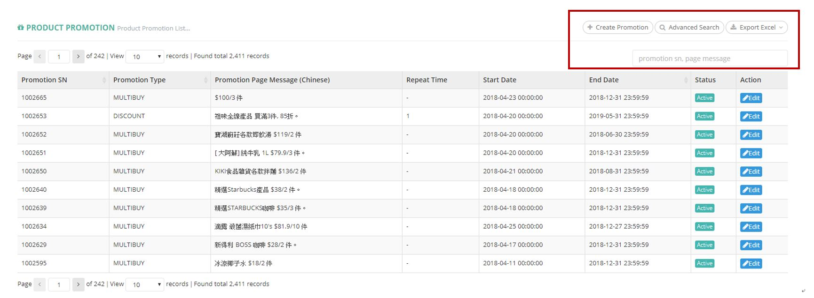
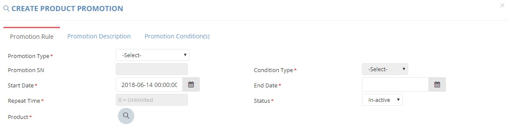
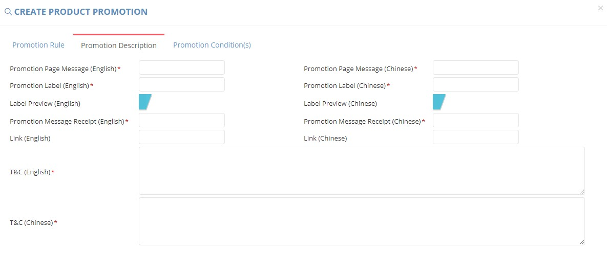
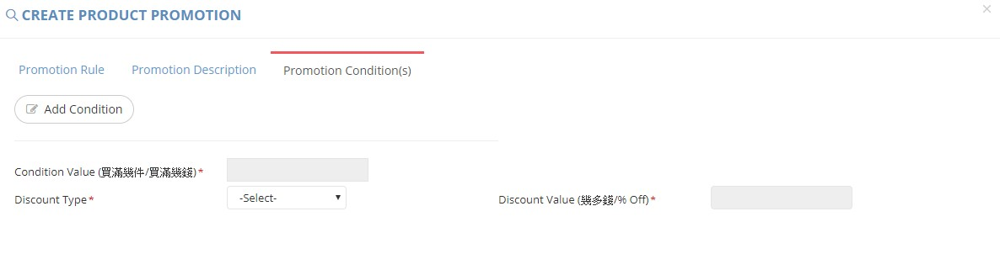
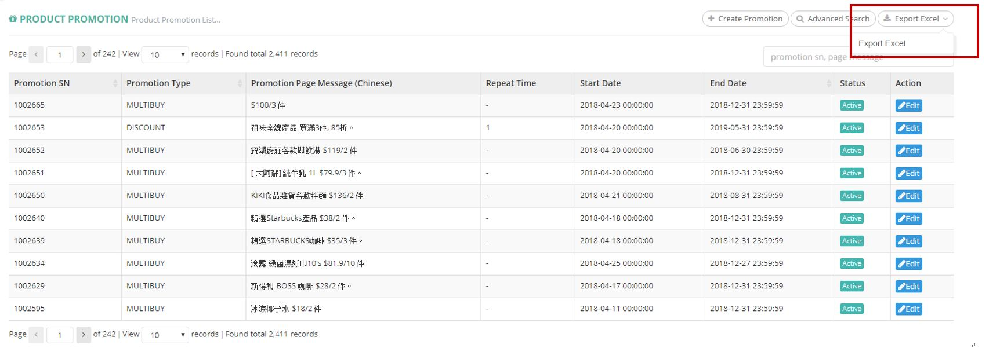

************
Product Promotion Module 
************
Product Promotion Module displays all the Product Promotion Items of all Products in the table.

|Productpromotionmodule|

.. list-table:: Product Promotion Module
    :widths: 10 50
    :header-rows: 1
    :stub-columns: 1

    * - FIELD NAME
      - FIELD DESCRIPTION
    * - Promotion SN
      - The Promotion Serial Number(ID)
    * - Promotion Type
      - The Promotion Type
    * - Promotion Page Message (Chinese)
      - The Chinese Message in The Promotion Page
    * - Repeat Time
      - How many times can the customer enjoy the promotion offer?
    * - Start Date
      - The Starting Date of Promotion
    * - End Date
      - The Final Date of Promotion
    * - Status
      - Active/Inactive Promotion
    * - Action
      - Active/Inactive Promotion

Buttons
==================
Users can select the buttons on top of the Product Promotion table to create, search and export product promotion items.
   
|Productpromotionbuttons|

.. list-table:: Product Promotion Module Buttons
    :widths: 10 50
    :header-rows: 1
    :stub-columns: 1

    * - FIELD NAME
      - FIELD DESCRIPTION
    * - Create Promotion
      - Users can create new Product Promotion Items
    * - Advanced Search 
      - Users can search target Product Promotion items by different criterion.
    * - Export Excel
      - Users can export Product Promotion Report in Excel Format
    * - Promotion sn, page message input box
      - Users can type Promotion ID or message content to carry out quick search
      
      
Create Product Promotion Items
==================
Users can create new Product Promotion items by clicking the “+ Create Promotion” Button on top of The Product Promotion table.

|Createproductpromotion1|
|Createproductpromotion2|
|Createproductpromotion3|

.. list-table:: Create Product Promotion Items Page
    :widths: 10 50
    :header-rows: 1
    :stub-columns: 1

    * - FIELD NAME
      - FIELD DESCRIPTION
    * - Promotion Type
      - The Type of Promotion
    * - Promotion SN
      - The Promotion ID
    * - Condition Type
      - The Type of Product Promotion Condition
    * - Start Date
      - The Starting Date of Promotion
    * - End Date
      - The Final Date of Promotion
    * - Repeat Time
      - How many times can the customer enjoy the promotion offer?
    * - Status
      - Active/Inactive Promotion
    * - Product
      - The Promotion Product
    * - Promotion Type
      - The Type of Promotion
    * - Promotion SN
      - The Promotion ID
    * - Condition Type
      - The Type of Product Promotion Condition
    * - Start Date
      - The Starting Date of Promotion
    * - End Date
      - The Final Date of Promotion
    * - Repeat Time
      - How many times can the customer enjoy the promotion offer?
    * - Status
      - Active/Inactive Promotion
    * - Product
      - The Promotion Product
    * - Promotion Type
      - The Type of Promotion
    * - Promotion SN
      - The Promotion ID
    * - Condition Type
      - The Type of Product Promotion Condition
    * - Start Date
      - The Starting Date of Promotion
    * - End Date
      - The Final Date of Promotion
    * - Repeat Time
      - How many times can the customer enjoy the promotion offer?
    * - Status
      - Active/Inactive Promotion
    * - Product
      - The Promotion Product
    * - Promotion Page Message (English)
      - The English Message in The Promotion Page
    * - Promotion Page Message (Chinese)
      - The Chinese Message in The Promotion Page
    * - Promotion Label (English)
      - The English promotion label which shows in the front end
    * - Promotion Label (Chinese)
      - The Chinese promotion label which shows in the front end
    * - Label Preview (English)
      - Preview "Promotion Label" effect, check if the characters length over the label size
    * - Label Preview (Chinese)
      - Preview "Promotion Label" effect, check if the characters length over the label size
    * - Promotion Message Receipt (English)
      - The English Promotion Message Receipt
    * - Promotion Message Receipt (Chinese)
      - The Chinese Promotion Message Receipt
    * - Link (English)
      - The Link of English Promotion Page
    * - Link (Chinese)
      - The Link of Chinese Promotion Page
    * - T&C (English)
      - The English Terms and Conditions
    * - T&C (Chinese)
      - The Chinese Terms and Conditions
    * - Condition Value
      - The Amount of Product/Value Condition for obtaining The Promotion
    * - Discount Type
      - The Type of Discount
    * - Discount Value
      - The Value of Discount

Product Promotion Report
==================
Users can export Product Promotion items in excel format by clicking the “Export Excel” button on top of the Product Promotion Table.

|Productpromotionreport|

.. list-table:: Product Promotion Report Column Headings
    :widths: 10 50
    :header-rows: 1
    :stub-columns: 1

    * - FIELD NAME
      - FIELD DESCRIPTION
    * - Promotion SN
      - The Promotion ID
    * - Promotion Type
      - The Promotion Type
    * - Promotion Page Message (Chinese)
      - The Chinese Promotion Page Message
    * - Repeat Time
      - The Amount of Time Repeating The Promotion Item
    * - Start Date
      - The Starting Date of The Promotion
    * - End Date
      - The Final Date of The Promotion
    * - Status
      - Active/ Inactive/ Expired Promotion Items

