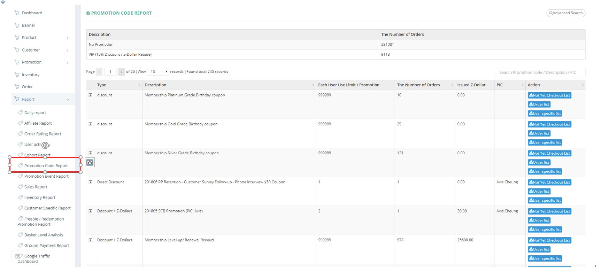
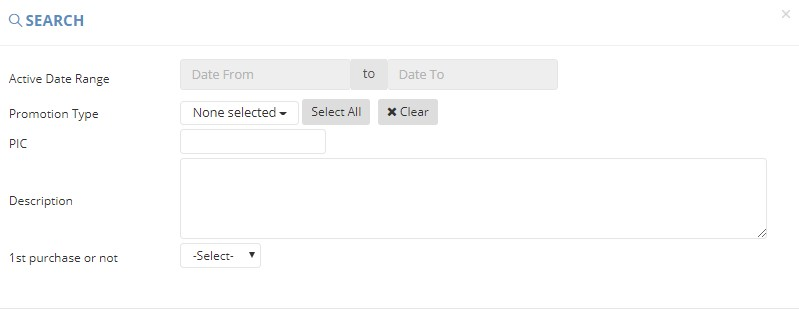

************
Promotion Code Report Module 
************
Promotion Code Report Module displays the details of different Promotion Code and their usage data.

|Promotioncodereportmodule|

.. list-table:: Promotion Code Report Module
    :widths: 10 50
    :header-rows: 1
    :stub-columns: 1

    * - FIELD NAME
      - FIELD DESCRIPTION
    * - Type
      - The Type of Promotion Code
    * - Description
      - The Description of Promotion
    * - Each User Use/Promotion
      - The Upper Limit of each Customer using the Promotion Code
    * - The Number of Orders
      - The Number of Orders used the Promotion Code
    * - Issued Z-Dollar
      - The Total Amount of Z-Dollar issued for the Promotion Code
    * - PIC
      - The Person In Charge for the Promotion Code
    * - Action
      - Download Not Yet Checkout List/ Download Order List/ Download User Specific List of The Promotion Code

    
Advanced Search
==================
Users can Search Promotion Code by clicking on the “Advanced Search” button on top of the Promotion Code Table and input different criterion into the popup window.

|Promotioncodereportadvancedsearch|

.. list-table:: Promotion Code Report Advanced Search Page
    :widths: 10 50
    :header-rows: 1
    :stub-columns: 1

    * - FIELD NAME
      - FIELD DESCRIPTION
    * - Active Date Range
      - The Active Date Range of the Promotion Code
    * - Promotion Type
      - The Type of Promotion
    * - PIC
      - The Person in Charge of the Promotion Code
    * - Description
      - The Description of Promotion
    * - 1st purchase or not
      - "Yes" or "no" of a Promotion Code for the 1st Purchase
  

