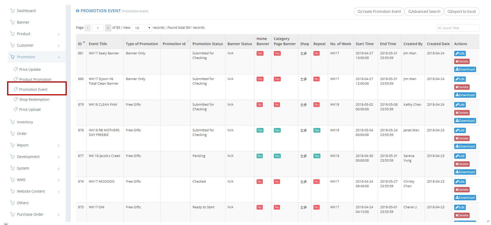
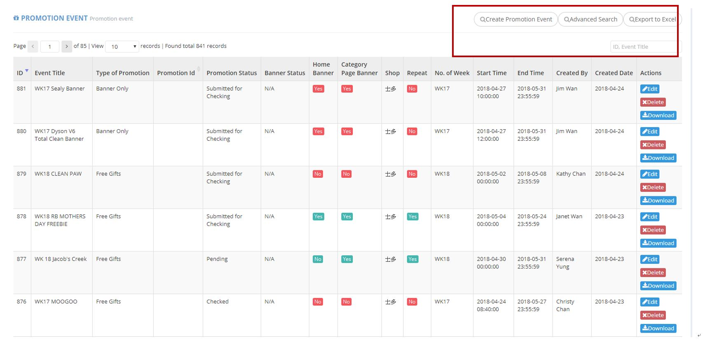
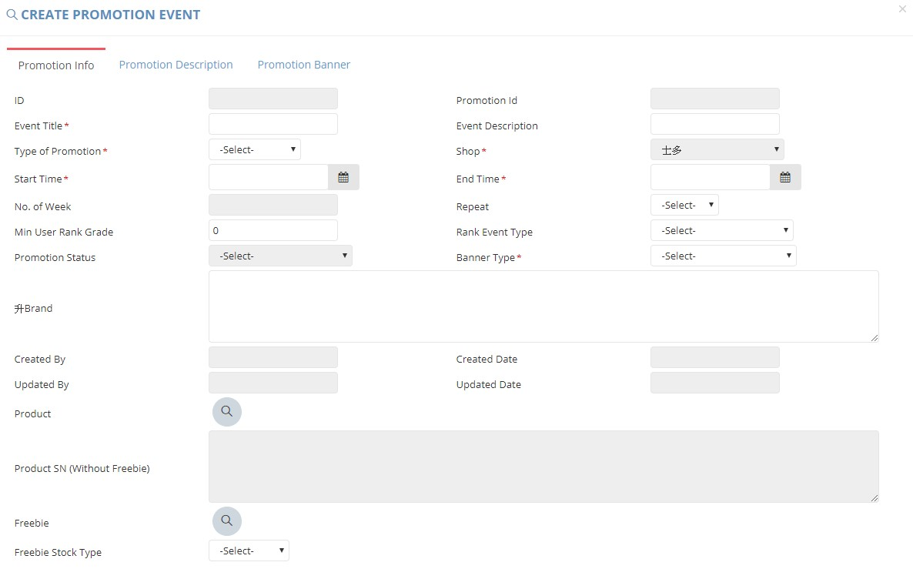
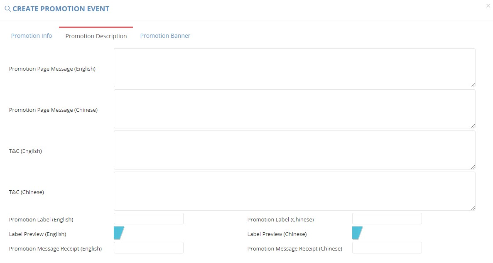
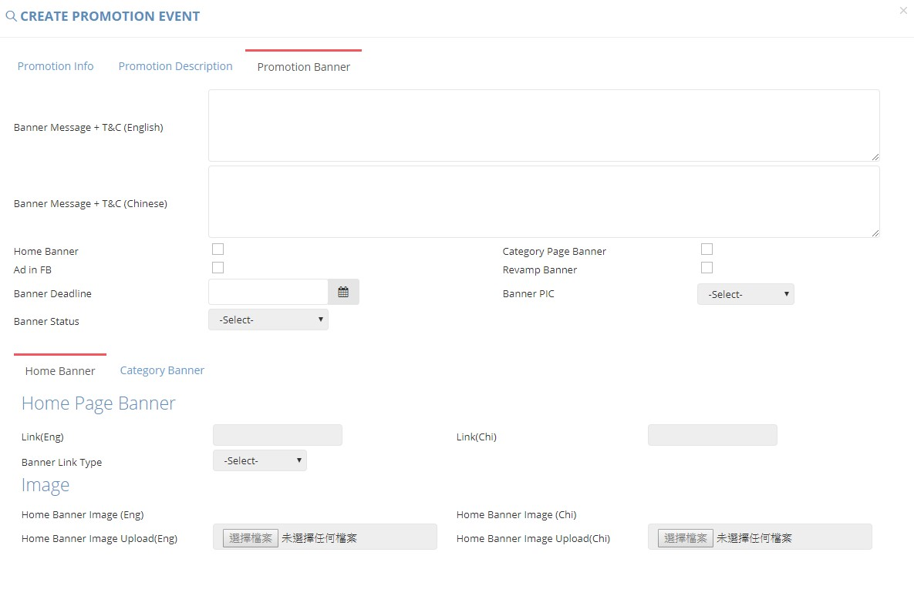
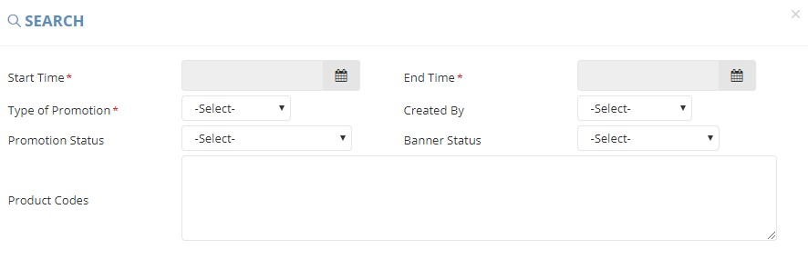
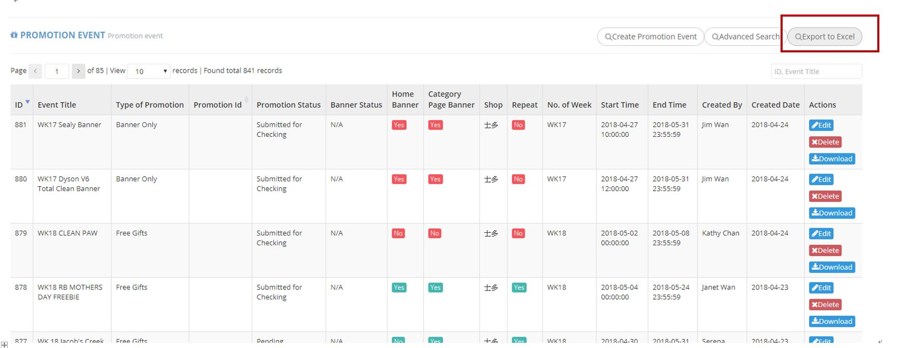

************
Promotion Event Module 
************
Promotion Event table displays the details all the Promotion Events. 

|Promotioneventmodule|

.. list-table:: Promotion Event Module
    :widths: 10 50
    :header-rows: 1
    :stub-columns: 1

    * - FIELD NAME
      - FIELD DESCRIPTION
    * - ID
      - The Promotion Event ID
    * - Event Title
      - The Event Title of Promotion
    * - Type of Promotion
      - The Type of Promotion
    * - Promotion Id
      - The Promotion ID
    * - Promotion Status
      - The Promotion Status
    * - Banner Status
      - The Banner Status ("N/A - No banner needed, Assigned - Has assigned a designer to work on, Completed - A banner is finished by design team, Banner Amend - The banner need to be revised by design team, Banner Completed - The banner is confirmed by marketing, Banner Launched - The banner is launched by merchandising"
    * - Home Banner
      - Have Home Banner? (Yes/No)
    * - Category Page Banner
      - Have Category Page Banner? (Yes/No)
    * - Shop
      - upload a banner and display it in different checkout pages. E.g. you can set the banner display in checkout/cart,         checkout/address... 
    * - Shop
      - The shop of Promotion Event
    * - Repeat
      - "Yes" or "No" of Repeat Promotion
    * - No. of Week
      - Belongs to which week
    * - Start Time
      - Belongs to which week
    * - End Time
      - The Final Date of Promotion Event
    * - Created By
      - The Person Create The Promotion Event
    * - Created Date
      - The Date of Creating The Promotion Event
    * - Actions
      - Edit - Edit Promotion Event Information, Delete - Delete Promotion Event Item, Download - Download Promotion Item Information

Buttons
==================
Users can select the buttons on top of the Promotion Event table to create, search and export Promotion Event items.

|Promotioneventbuttons|

.. list-table:: Promotion Event Module
    :widths: 10 50
    :header-rows: 1
    :stub-columns: 1

    * - FIELD NAME
      - FIELD DESCRIPTION
    * - Create Promotion Event
      - Users can create new Promotion Event Items
    * - Advanced Search
      - Users can search target Promotion Event items by different criterion.
    * - Export Excel
      - Users can export Promotion Event Report in Excel Format
    * - ID, Event Title input box
      - Users can type Promotion Event ID or Event Title to carry out quick search

Create Promotion Event
==================
Users can create new Promotion Event Items by clicking on the “Create Promotion Event” Button on top of the Promotion Event table.

|Createpromotionevent1|
|Createpromotionevent2|
|Createpromotionevent3|

.. list-table:: Create Promotion Event Page
    :widths: 10 50
    :header-rows: 1
    :stub-columns: 1

    * - FIELD NAME
      - FIELD DESCRIPTION
    * - ID
      - The Promotion Event ID
    * - Promotion Id
      - The Promotion ID
    * - Event Title
      - The Title of Promotion Event
    * - Event Description
      - The Description of Promotion Event
    * - Type of Promotion
      - The Type of Promotion
    * - Shop
      - The Shop for Promotion
    * - Start Time
      - The Starting Date of The Promotion Event
    * - End Time
      - The Final Date of The Promotion Event
    * - No. of Week
      - The Number of Weeks The Promotion Event Last 
    * - Repeat
      - "Yes"/ "No" Repeat Promotion Event
    * - Min User Rank Grade
      - The Minimum User Grade condition for The Promotion Event
    * - Rank Event Type
      - For membership offer only (- Early Access Promotion (higher grade membership can enjoy first, 2 hours period 1 grade, large to small))
    * - Promotion Status
      - The Status of Promotion
    * - Banner Type
      - The Type of Promotion Banner
    * - 升Brand
      - What brand need to push the ordering to top?
    * - Created By
      - The Person Creating The Promotion Event
    * - Created Date
      - The Date of Creating The Promotion Event
    * - Updated By
      - The Latest Update Date of Promotion Event
    * - Updated Date
      - The Latest Update Date of Promotion Event
    * - Product
      - The Product of Promotion
    * - Product SN (Without Freebie)
      - The Serial Number of Product in Promotion Event
    * - Freebie
      - Includes which items as freebie
    * - Freebie Stock Type
      - Select normal and clearance as stock type
    * - Remarks (Merchandising)
      - The Additional Information from The Merchandising Team
    * - Remarks (Marketing)
      - The Additional Information from The Marketing Team
    * - Remarks (Technical)
      - The Additional Information from The Technical Team
    * - Remarks (Design)
      - The Additional Information from The Design Team
    * - Promotion Page Message (English)
      - The English Message of Promotion Description in Promotion Page
    * - Promotion Page Message (Chinese)
      - The Chinese Message of Promotion Description in Promotion Page
    * - T&C (English)
      - The English Terms and Conditions
    * - T&C (Chinese)
      - The Chinese Terms and Conditions
    * - Promotion Label (English)
      - The English promotion label which shows in the front end
    * - Promotion Label (Chinese)
      - The Chinese promotion label which shows in the front end
    * - Label Preview (English)
      - Preview "Promotion Label" effect, check if the characters length over the label size
    * - Label Preview (Chinese)
      - Preview "Promotion Label" effect, check if the characters length over the label size
    * - Promotion Message Receipt (English)
      - The English Promotion Message Receipt
    * - Promotion Message Receipt (Chinese)
      - The Chinese Promotion Message Receipt
    * - Banner Message + T&C (English))
      - Information provided for design team to know what condition that the banner
    * - Banner Message + T&C (Chinese)
      - Information provided for design team to know what condition that the banner
    * - Home Banner
      - Select If have Home Banner
    * - Category Page Banner
      - Select if have Category Banner
    * - Ad in FB
      - Select if have Advertisement on Facebook
    * - Revamp Banner
      - Select if have revamp Banner
    * - Banner Deadline
      - The Final Date of Banner Posting
    * - Banner PIC
      - The Person in Charge for The Banner
    * - Banner Status
      - The status of design process for banner
    * - Link(Eng)
      - The Link of English Home Page Banner
    * - Link(Chi)
      - The Link of Chinese Home Page Banner
    * - Banner Link Type
      - The banner link is internal website or external website
    * - Home Banner Image Upload(Eng)
      - Upload The Chinese Home Page Banner here
    * - Page Url
      - The Page Link of Category Banner
    * - Subanner Location
      - Which categories display this subanner
    * - Category Banner Image 1 Upload(Eng)
      - Upload The English Category Banner Image here
    * - Category Banner Image 1 Upload(Chi)
      - Upload The Chinese Category Banner Image here
    * - Category Banner Link 1(Eng)
      - The Link of English Category Banner
    * - Category Banner Link 1(Chi)
      - The Link of Chinese Category Banner
    * - Category Banner Image 2 Upload(Eng)
      - Upload The English Category Banner Image here
    * - Category Banner Image 2 Upload(Chi)
      - Upload The Chinese Category Banner Image here
    * - Category Banner Link 2(Eng)
      - The Link of English Category Banner
    * - Category Banner Link 2(Chi)
      - The Link of Chinese Category Banner

Advanced Search
==================
Users can search targeted Promotion Event items by clicking “Advanced Search” button on top of the Promotion Event table and input different criterion in the popup window.

|Promotioneventadvancedsearch|

.. list-table:: Promotion Event Advacned Search Page
    :widths: 10 50
    :header-rows: 1
    :stub-columns: 1

    * - FIELD NAME
      - FIELD DESCRIPTION
    * - Start Time
      - The Starting Date of Promotion Event
    * - End Time
      - The Final Date of Promotion Event
    * - Type of Promotion
      - The Type of Promotion
    * - Created By
      - The Person Creating The Promotion Event
    * - Promotion Status
      - The Status of Promotion Event
    * - Banner Status
      - The Status of Promotion Banner
    * - Product Codes
      - The Codes of The Products To be Searched

Promotion Event Report
==================
Users can export Promotion Event items in Excel format by clicking on the “Export to Excel” button on top of the Promotion Event table

|Promotioneventreport|

.. list-table:: Promotion Event Column Headings
    :widths: 10 50
    :header-rows: 1
    :stub-columns: 1

    * - FIELD NAME
      - FIELD DESCRIPTION
    * - #
      - The Promotion Event ID
    * - PIC
      - The Person in Charge of The Promotion Event
    * - Type of Promotion
      - The Type of Promotion Event
    * - Name of Promotion
      - The Name of Promotion Event
    * - Start Date
      - The Starting Date of The Promotion Event
    * - End Date
      - The Final Date of The Promotion Event
    * - Item Code
      - The Product ID
    * - Chinese Brand Name
      - The Chinese Product Brand Name
    * - Chinese Product Description
      - The Chinese Product Description
    * - Packsize
      - The Product Packsize
    * - Item Code
      - The Product ID
    * - Chinese Brand Name
      - The Chinese Product Brand Name
    * - Chinese Product Description
      - The Chinese Product Description
    * - Packsize
      - The Product Packsize
    * - Standard Retail Price
      - The start date of promotion
    * - Production Date
      - The start date of promotion
    * - Promotion ID
      - The Promotion ID
    * - Status
      - 	
    * - IT remark
      - Remark added by IT team
    * - Promotion Page Message(Chi)
      - The Chinese Promotion Page Message
    * - Promotion Page Message(Eng)
      - The English Promotion Page Message
    * - T&C(Chi)
      - The Chinese Terms and Conditions
    * - T&C(Eng)
      - The English Terms and Conditions
    * - Repeat
      - Yes/No. If a promotion is repeatable, for example buy1 get 1 free, buy 2 will get 2
    * - Promotion Label (Chinese)[Max.:20 characters]中文字=2 characters
      - The Chinese Promotion Label Content of the Promotion Event
    * - Promotion Label (English)[Max.:20 characters]
      - The English Promotion Label Content of the Promotion Event.	
    * - Promotion Message Receipt (Chinese)[Max:100 characters]中文字=2 characters
      - The Chinese Customer Message Receipt Content of the Promotion Event
    * - Promotion Message Receipt (English)[Max.:100 characters]
      - The English Customer Message Receipt Content of the Promotion Event
    * - PIC
      - The Person in Charge of The Promotion Event
    * - Status
      - The Promotion Event Status
    * - Banner Message(Chinese)
      - The Chinese Banner Message
    * - Banner Message(Eng)
      - The English Banner Message
    * - Front Page Banner
      - Determine if there is a front page banner for this promotion
    * - Subanner
      - Determine if there is a subanner for this promotion
    * - Half Banner
      - Will subanner is half banner?
    * - Subanner Location
      - the location to display subanner
    * - Facebook
      - Will be promoted in FB?

