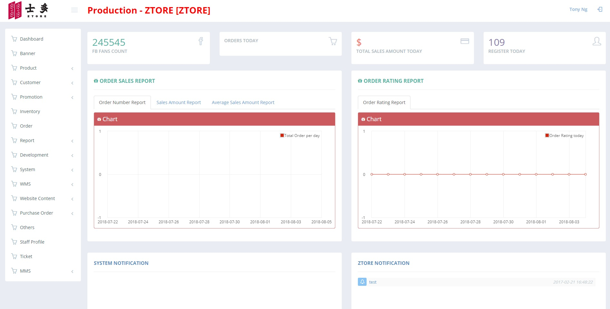

**************************
CMS User Guide
**************************

This CMS User Guide serves the purpose of providing explanations and introduction on different Modules in the CMS System of Ztore.

|homepage|

The ``sphinx_rtd_theme`` is a sphinx_ theme designed to look modern and be mobile-friendly.
This theme is primary focused to be used on readthedocs.org_ but can work with your
own sphinx projects. To read more and see a working demo_ head over to readthedocs.org_.

.. _sphinx: http://www.sphinx-doc.org
.. _readthedocs.org: http://www.readthedocs.org
.. _demo: https://sphinx-rtd-theme.readthedocs.io/en/latest/

Installing
==========

The theme is distributed on PyPI_ and can be installed with pip::

   pip install sphinx_rtd_theme

For more information read the full installing docs
`here <https://sphinx-rtd-theme.readthedocs.io/en/latest/installing.html>`__.

.. _PyPI: https://pypi.python.org/pypi/sphinx_rtd_theme

Configuration
=============

The ``sphinx_rtd_theme`` is highly customizable on both the page level and on a global level.
To see all the possible configuration options read the configuring docs
`here <https://sphinx-rtd-theme.readthedocs.io/en/latest/configuring.html>`__.

Contributing
============

If you would like to help improve the theme or have more control
over the theme in case of a fork please read our contributing guide
`here <https://sphinx-rtd-theme.readthedocs.io/en/latest/contributing.html>`__.

