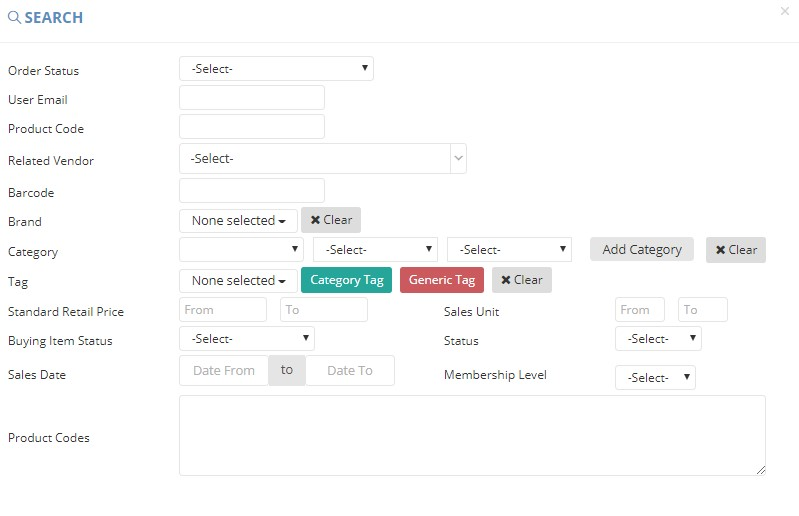

************
Sales Report Module 
************
Sales Report Module displays the Sales Information of different Products.

|Salesreportmodule|

.. list-table:: Banner Module
    :widths: 10 50
    :header-rows: 1
    :stub-columns: 1

    * - FIELD NAME
      - FIELD DESCRIPTION
    * - Date 
      - The Date of Sales
    * - Product Code
      - The Product Code of Sales
    * - Ecom Cat (Eng)
      - The first layer of category
    * - Ecom Sub-Cat (Eng)
      - The second layer of category
    * - Ecom Sub-Sub-Cat (Eng)
      - The third layer of category
    * - English Brand Name
      - The Name of Brand in English
    * - English Product Name
      - The Name of Product in English
    * - Chinese Brand Name
      - The Name of Brand in Chinese
    * - Chinese Product Description
      - The Description of Product in Chinese 
    * - Packsize 
      - The Pack size of Product in Chinese
    * - Sales 
      - The Total Sales Amount of The Product
    * - Sales Unit
      - The Unit of Sales
    * - Membership Level
      - The Membership Level of Customers in the Sales
    * - Total Order
      - The Total Number of Order made for The Product
    * - Total Margin
      - The total profit of this product (total sale values of this product deducts total cost of this product)
    * - Total Margin %
      - The percentage of margin (total Margin / total sale values)
      
      
Search Sales 
==================
Users can search for Sales Details by clicking on the “Search Sales” button and inputting different criterion into the popup window.

|Searchsales|

.. list-table:: Search Sales Page
    :widths: 10 50
    :header-rows: 1
    :stub-columns: 1

    * - FIELD NAME
      - FIELD DESCRIPTION
    * - Order Status 
      - The Order Status of The Sales
    * - User Email
      - The Email of Customer Making the Order
    * - Product Code
      - The Product Code in The Sales
    * - Related Vendor
      - The Related Vendor of The Product
    * - Barcode
      - The Barcode of The Product
    * - Brand
      - The Brand of The Product
    * - Category
      - The Category of The Product
    * - Tag
      - The Tag of The Product
    * - Standard Retail Price
      - The Standard Retail Price of The Product
    * - Sales Unit 
      - Input the range of total sale qty to search
    * - Buying Item Status
      - The Status of the Product Ordered
    * - Status
      - The Status of The Sales Order
    * - Sales Date
      - The Date of making the Sales Order
    * - Membership Level
      - The Membership Level of Customer making the Sales Order
    * - Product Codes
      - The Product Codes involved in the Sales Order
    
Sales Report
==================
Users can Export Sales Detail in Excel Format by choosing the Report Type and click on the “Export to Excel” Option from the “Export Excel”

|Salesreport|

.. list-table:: Sales Report Column Headings
    :widths: 10 50
    :header-rows: 1
    :stub-columns: 1

    * - FIELD NAME
      - FIELD DESCRIPTION
    * - Date 
      - The Date of Sales Figure
    * - Product Code
      - The Product ID Sales Figure
    * - Ecom Cat (Eng)
      - The English Ecommerce Category of The Product
    * - Ecom Sub-Cat (Eng)
      - The English Ecommerce Sub-Category of The Product
    * - Ecom Sub-Sub-Cat (Eng)
      - The English Ecommerce Sub-Sub-Category of The Product
    * - English Brand Name
      - The English Product Brand Name
    * - English Product Description
      - The English Product Description
    * - Chinese Brand Name
      - The Chinese Product Brand Name
    * - Chinese Product Description
      - The Chinese Product Description
    * - Packsize
      - The Product Pack size
    * - Sales Value
      - The Product Sales Value
    * - Sales Unit
      - The Product Sales Unit
    * - Membership Level
      - The Customer Membership Level of The Order
    * - Total Order
      - The Total Order Value by The Customer
    * - Total Margin
      - The Total Margin of The Product
    * - Total Margin%
      - The Margin Percentage of The Product
    * - Z-dollar Rebate
      - The Z-Dollar Rebate Amount of The Order

   
