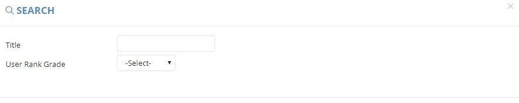

************
Shop Redemption Module 
************
The Shop Redemption Module shows all the redemption events in the table.

|Shopredemptionmodule|

.. list-table:: Shop Redemption Module
    :widths: 10 50
    :header-rows: 1
    :stub-columns: 1

    * - FIELD NAME
      - FIELD DESCRIPTION
    * - ID
      - The Shop Redemption ID
    * - Type
      - The Type of Shop Redemption
    * - Title(Eng)
      - The English Title of Shop Redemption
    * - Title(Chi)
      - The Chinese Title of Shop Redemption
    * - Sort Order
      - The Relative Importance of Shop Redemption
    * - Total Qty
      - The Total Quantity of Shop Redemption made
    * - Current Qty
      - The Current Quantity of Shop Redemption made
    * - Redeem Quota Limit
      - The Highest Amount of Redemption can be made by each Customer
    * - Start Time
      - The Starting Date of Shop Redemption
    * - End Time
      - The Final Date of Shop Redemption
    * - Status
      - Active/ Inactive Shop Redemption
    * - Actions
      - Edit - Edit Shop Redemption Item Information, Download - Download Redemption Item, Delete - Delete Redemption Item
      
Buttons
==================
Users can select the buttons on top of the Promotion Event table to create and search Shop Redemption items.

|Shopredemptionbuttons|

.. list-table:: Shop Redemption Module Buttons
    :widths: 10 50
    :header-rows: 1
    :stub-columns: 1

    * - FIELD NAME
      - FIELD DESCRIPTION
    * - Create Shop Redemption
      - Users can create new Shop Redemption Items
    * - Advanced Search
      - Users can search target Shop Redemptions items by different criterion.
    * - Other Search
      - Users can search target Shop Redemptions items by different status.
    * - Title input box
      - Users can type Shop Redemption Items Title to carry out quick search
      
Advanced Search
==================
Users can search targeted Shop Redemption Items by clicking on the “Advanced Search” button on top of the Shop Redemption table and input the criterion of search.

|Shopredemptionadvancedsearch|

.. list-table:: Shop Redemption Advanced Search Page
    :widths: 10 50
    :header-rows: 1
    :stub-columns: 1

    * - FIELD NAME
      - FIELD DESCRIPTION
    * - Title
      - The Title of Shop Redemption
    * - User Rank Guide
      - The User Grade of Obtaining The Shop Redemption

Create Shop Redemption Item
==================
Users can create new Shop Redemption items by clicking on the “+ Create Shop Redemption” button on top of the Shop Redemption table.

|Createshopredemption|

.. list-table:: Create Shop Redemption Item Page
    :widths: 10 50
    :header-rows: 1
    :stub-columns: 1

    * - FIELD NAME
      - FIELD DESCRIPTION
    * - ID
      - The Shop Redemption ID
    * - Type
      - The Type of Shop Redemption
    * - Start Time
      - The Starting Date of Shop Redemption
    * - End Time
      - The Ending Date of Shop Redemption
    * - Title(Eng)
      - The English Title of Shop Redemption
    * - Title(Chi)
      - The Chinese Title of Shop Redemption
    * - Redeem Quota Limit
      - The Upper Limit of Shop Redemption can be made by Customer
    * - User Rank Grade
      - The User Grade of obtaining The Shop Redemption
    * - Total Qty
      - The Total Quantity available for Shop Redemption
    * - Current Qty
      - The Current Quantity of Shop Redemption made
    * - Sort Order
      - The Relative Importance of Shop Redemption
    * - Status
      - Active/Inactive Shop Redemption
    * - Description(Eng)
      - The English Description of Shop Redemption
    * - Description(Chi)
      - The Chinese Description of Shop Redemption
    * - Image 1
      - Upload The Shop Redemption Image here
    * - Image 2
      - Upload The Shop Redemption Image here
    * - Image 3
      - Upload The Shop Redemption Image here
    * - Image 4
      - Upload The Shop Redemption Image here
    * - Image 5
      - Upload The Shop Redemption Image here
      
Other Search
==================
Users can carry out a quick search of Shop Redemption items by clicking on the “Other Search” button according to the status of Shop Redemption Items.     

|Shopredemptionothersearch|

 .. list-table:: Shop Redemption Other Search
    :widths: 10 50
    :header-rows: 1
    :stub-columns: 1

    * - FIELD NAME
      - FIELD DESCRIPTION
    * - Get On-Going
      - Show Active shop redemption items
    * - Get Non-Expired
      - Show non-expired shop redemption items
    * - Get Expired
      - Show only Expired Shop Redemption Items
    * - Get All
      - Show all Shop Redemption Items
 

