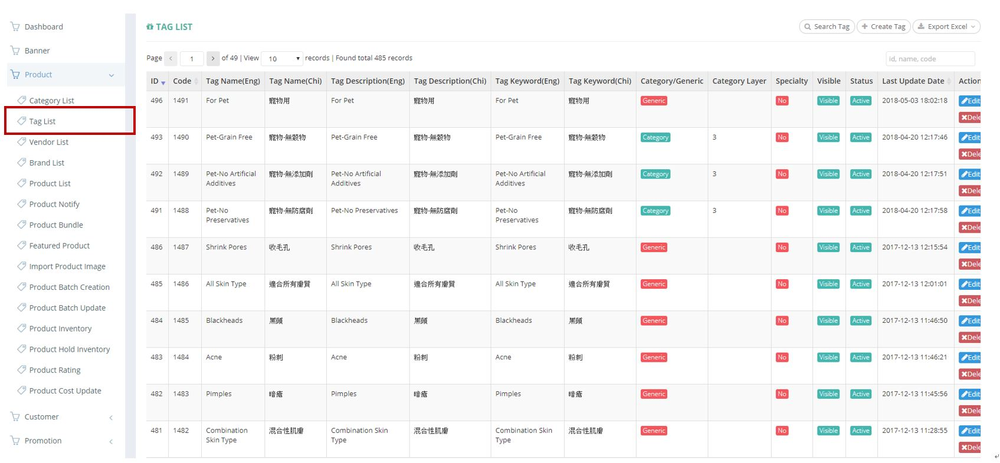
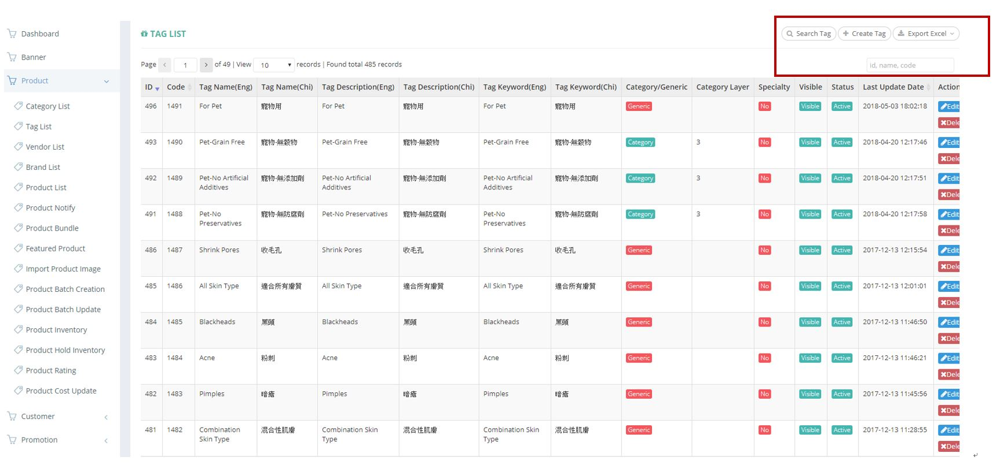
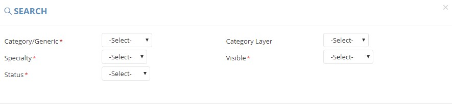
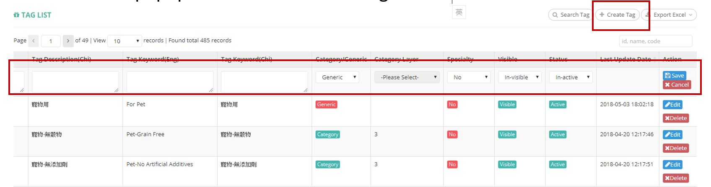
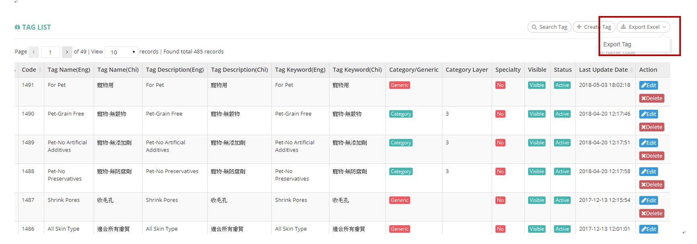

************
Tag List Module 
************

Tag List Module displays the detailed information of all the Tags. Users can search, create and export Tags report by clicking on the buttons on top of the table. Users can also edit and delete individual Tag items by clicking the buttons in the “Action” column of the corresponding Tag items.

|Tagmodule|

.. list-table:: Tag List Module
    :widths: 10 50
    :header-rows: 1
    :stub-columns: 1

    * - FIELD NAME
      - FIELD DESCRIPTION
    * - ID 
      - The Tag ID
    * - Code
      - The Tag Code
    * - Tag Name(Eng)
      - The Name of Tag in English
    * - Tag Name(Chi) 
      - The Name of Tag in Chinese
    * - Tag Description(Eng)
      - The Description of Tag in English
    * - Tag Description(Chi)
      - The Description of Tag in Chinese
    * - Tag Keyword(Eng)
      - The keyword of Tag in English
    * - Tag Keyword(Chi)
      - The keyword of Tag in Chinese
    * - Category/Generic
      - The option of putting Tag under "Generic" or with respective "Category"
    * - Category(Layer)
      - The corresponding Category if the Tag is classified with "Category".
    * - Specialty
      - "Yes" or "No" Tag Specialty
    * - Visible
      - Visible/ Invisible Tag
    * - Status
      - Active/ Inactive Tag
    * - Last Update Date
      - The Date of Latest Tag Update
    * - Action
      - Edit - Edit Tag Item Information, Delete - Delete Tag Item, Save - Save Updated Tag Information, Cancel - Cancel Tag Item Editing

       
Buttons
==================
Users can search, create and export Tags report by clicking on the buttons on top of the table. They can also input Tag ID, name and code in the input box for quick search of corresponding Tag.

|Tagbuttons|

.. list-table:: Tag List Module Buttons
    :widths: 10 50
    :header-rows: 1
    :stub-columns: 1

    * - FIELD NAME
      - FIELD DESCRIPTION
    * - Search Tag
      - Users can search targeted Tags with different criterion
    * - Create Tag
      - Users can create new Tags
    * - Export Excel
      - Users can export Tag Reports
    * - Id, name, code Input Box
      - Users can input Tag ID, name or Code into the input box for quick search.

Search Tags
==================
Users can click on the “Search Tag” button on top of the Tag table and enter different criterion in the popup window for Tag searching

|Searchtag|

.. list-table:: Search Tag
    :widths: 10 50
    :header-rows: 1
    :stub-columns: 1

    * - FIELD NAME
      - FIELD DESCRIPTION
    * - Category/Generic
      - Category or Generic Tag
    * - Category Layer
      - The corresponding Category if the Tag is classified with "Category".
    * - Specialty
      - "Yes" or "No" Specialty Tag
    * - Visible
      - Visible or Invisible Tag
    * - Status
      - Active or Inactive Tag

Create Tags
==================
Users can click on the “Create Tag” button on top of the Tag table and enter different criterion in the popup window for the new Tag details.

|Createtag|

.. list-table:: Create Tag
    :widths: 10 50
    :header-rows: 1
    :stub-columns: 1

    * - FIELD NAME
      - FIELD DESCRIPTION
    * - Tag Name(Eng)
      - The English Name of New Tag
    * - Tag Name(Chi) 
      - The Chinese Name of New Tag
    * - Tag Description(Eng)
      - The English Description of New Tag
    * - Tag Description(Chi)
      - The Chinese Description of New Tag
    * - Tag Keyword(Eng)
      - The English Keyword of New Tag
    * - Tag Keyword(Chi)
      - The Chinese Keyword of New Tag
    * - Category/Generic
      - Category or Generic New Tag
    * - Category(Layer)
      - The corresponding Category if the Tag is classified with "Category".
    * - Specialty
      - "Yes" or "No" Tag Specialty
    * - Visible
      - Visible/ Invisible Tag
    * - Status
      - Active/ Inactive Tag
    * - Last Update Date
      - The Latest Update Date for The Tag
    * - Action
      - Save - Save Updated Tag Information, Cancel - Cancel Tag Item Editing

Tag Report
==================
Users can export the details of different Tags in Excel format by clicking on the “Export Excel” button on top of the Tag table.

|Tagreport|

.. list-table:: Tag Report
    :widths: 10 50
    :header-rows: 1
    :stub-columns: 1

    * - FIELD NAME
      - FIELD DESCRIPTION
    * - ID
      - The Tag ID
    * - Code 
      - The Tag Code
    * - Tag Name(Eng)
      - The English Tag Name
    * - Tag Name(Chi)
      - The Chinese Tag Name
    * - Tag Description(Eng)
      - The English Tag Description
    * - Tag Description(Chi)
      - The Chinese Tag Description
    * - Tag Keyword(Eng)
      - The English Tag Keyword
    * - Tag Keyword(Chi)
      - The Chinese Tag Keyword
    * - Category/Genuine
      - "Category"/ "Generic" Product
    * - Category Layer
      - The corresponding Category if the Tag is classified with "Category".
    * - Specialty
      - "Yes" or "No" Tag Specialty
    * - Visible
      - Visible/ Invisible Product
    * - Status
      - Active/ Inactive Product
    * - Last Update Date
      - The Latest Date of Product Update
    

