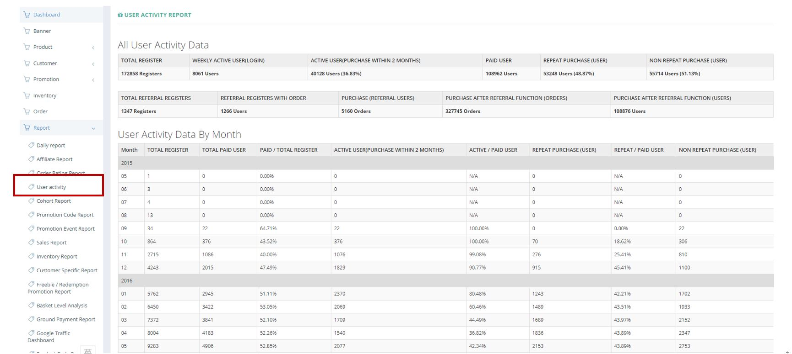

************
User Activity Module 
************
User Activity Module displays the Overall User Activity and Monthly User Activity Data.

|Useractivitymodule|

.. list-table:: User Activity Module Page
    :widths: 10 50
    :header-rows: 1
    :stub-columns: 1

    * - FIELD NAME
      - FIELD DESCRIPTION
    * - Total Register
      - The Total Number of Registered User in Ztore
    * - Weekly Active User (Login)
      - The Total Number of Users That Login Within a Week
    * - Active User(Purchase within 2 Months)
      - The Total Number of Users That Made Purchase Within Last 2 Months
    * - Paid User
      - The Total Number of Users That Made Purchase before
    * - Repeat Purchase(User)
      - The Total Number of Users That Made More Than 1 Purchase
    * - Non Repeat Purchase(User)
      - The Total Number of Users That Made Only 1 Purchase
    * - Total Referral Registers
      - The Total Number of Registered Referral Users
    * - Referral Registers With Order
      - The Total Number of Registered Referral Users Making At Least 1 Order
    * - Purchase(Referral Users)
      - The Total Number of Purchase Made by Referral Users
    * - Purchase After Referral Function(Orders)
      - The number of Orders made after referral
    * - Purchase After Referral Function(Users)
      - The number of users take orders after referral
    * - Month
      - The Corresponding Month of Data in that Row
    * - Total Register
      - The Number of Customers registered in Ztore
    * - Total Paid User
      - The Number of Paid Customers registered in Ztore
    * - Paid/ Total Register
      - The proportion of Paid Customers to Total Customers
    * - Active User(Purchase Within 2 Months)
      - The Number of Customers made order within last 2 months)
    * - Active/ Paid User
      - The proportion of Active Customers to Paid Customers
    * - Repeat Purchase (User)
      - The Number of Repeat Purchasing Customers 
    * - Repeat/ Paid User
      - The Proportion of Repeat Customers to Paid Customers
    * - Non Repeat Purchase (User)
      - The Number of Non Repeat Purcjasing Customers
      
      

