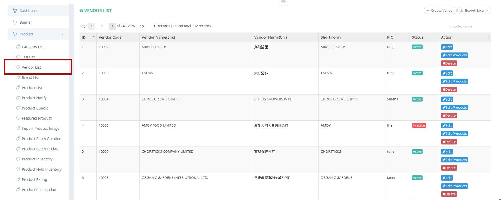
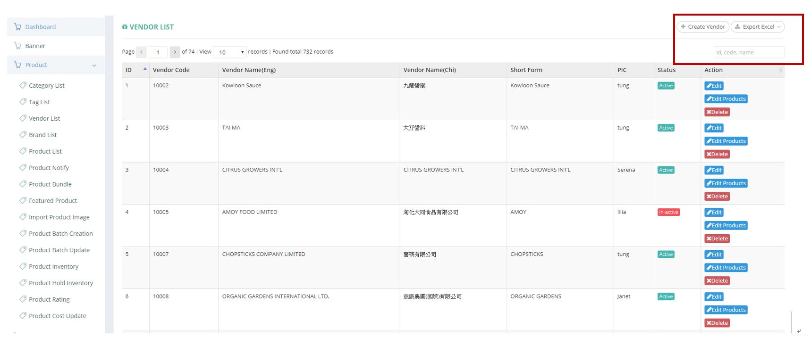
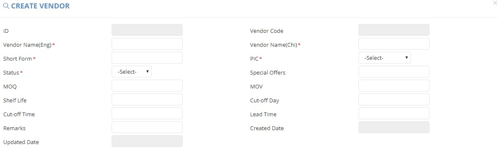
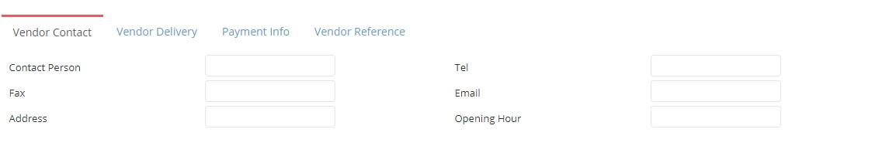
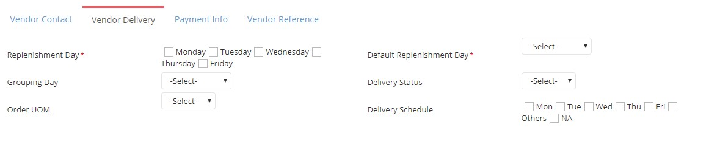
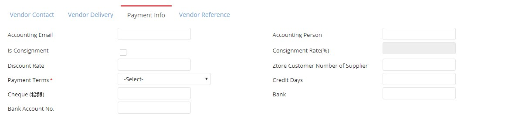
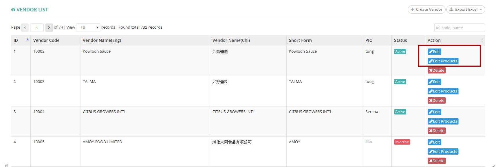
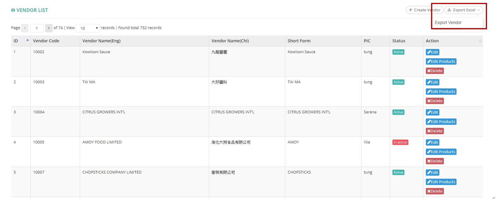

************
Vendor List Module 
************

Vendor List displays the details of different Vendors. Users can create vendors and export Vendor Reports by clicking the buttons on top of the Vendor List Table. They can also edit, delete the individual vendor details by clicking on the buttons in the “action” column of corresponding Vendor item.

|Vendormodule|

.. list-table:: Vendor List Module
    :widths: 10 50
    :header-rows: 1
    :stub-columns: 1

    * - FIELD NAME
      - FIELD DESCRIPTION
    * - ID 
      - The Vendor ID
    * - Vendor Code
      - The Vendor Code
    * - Vendor Name(Eng)
      - The Name of Vendor in English
    * - Vendor Name(Chi)
      - The Name of Vendor in Chinese
    * - Short Form
      - The Simplified Name of the Vendor
    * - PIC
      - The Person-in-charge for the Vendor
    * - Status
      - Active/ Inactive Vendor
    * - Action
      - Edit - Edit Vendor Item Information. Edit Products - Edit Products Information of The Vendor, Delete - Delete Vendor Item

Buttons
==================
Users can create new vendor items and export vendor reports by clicking on the buttons on top of the Vendor List table. You can also input vendor ID, Code or Name for quick search in the input box.

|Vendorbuttons|

.. list-table:: Vendor List Module Buttons
    :widths: 10 50
    :header-rows: 1
    :stub-columns: 1

    * - FIELD NAME
      - FIELD DESCRIPTION
    * - Create Vendor
      - User can create new vendor 
    * - Export Excel
      - User can export vendor details in Excel format
    * - Id, code, name Input Box
      - User can carry out quick vendor search by inputting Vendor ID, Code and Name into the Input Box
    

Create Vendors
==================
Users can create new Vendor by clicking the “Create Vendor” button on top of The Vendor List table and enter different vendor details into the popup window.

|Createvendor|

.. list-table:: Vendor List Module Buttons
    :widths: 10 50
    :header-rows: 1
    :stub-columns: 1

    * - FIELD NAME
      - FIELD DESCRIPTION
    * - ID
      - The Vendor ID
    * - Vendor Code
      - The Vendor Code
    * - Vendor Name(Eng)
      - The English Name of Vendor
    * - Vendor Name(Chi)
      - The Chinese Name of Vendor
    * - Short Form
      - The Simplified Name of the Vendor
    * - PIC
      - The Person in Charge for the Vendor
    * - Status
      - Active/ Inactive Vendor
    * - Special Offers
      - Remarks about Vendor offers some special offers
    * - MOQ
      - The min order qty about purchase
    * - MOV
      - The min order value about purchase
    * - Shelf Life
      - The shelf life for this vendor' product
    * - Cut-off Day
      - Cut off day before delivery for this vendor, such as T-1 and T means today
    * - Cut-off Time
      - Cut off time before delivery for this vendor
    * - Lead Time
      - Delivery time after purchase
    * - Remarks
      - The Additional Information of The Vendor
    * - Created Date
      - The Date of Creating The Vendor Item
    * - Update Date
      - The Latest Update Date of The Vendor

Create Vendor - Vendor Contact
------------------
Users can input the contact details of the new Vendor in the “Vendor Contact” session.

|Createvendorvendorcontact|
      
.. list-table:: Create Vendor Vendor Contact
    :widths: 10 50
    :header-rows: 1
    :stub-columns: 1

    * - FIELD NAME
      - FIELD DESCRIPTION
    * - Contact Person
      - The Name of Contact Person for The Vendor
    * - Tel
      - The Telephone Number of The Vendor
    * - Fax
      - The Fax of The Vendor
    * - Email
      - The Email of The Vendor
    * - Address
      - The Address of The Vendor
    * - Opening Hour
      - The Opening Hours of The Vendor

Create Vendor - Vendor Delivery
------------------
Users can input the Delivery information of the new Vendor in the “Vendor Delivery” session.

|Createvendorvendordelivery|

.. list-table:: Create Vendor Vendor Delivery
    :widths: 10 50
    :header-rows: 1
    :stub-columns: 1

    * - FIELD NAME
      - FIELD DESCRIPTION
    * - Replenishment Day
      - The Weekday of Replenishment from The Vendor
    * - Default Replenishment Day
      - The Default Vendor Replenishment Weekday
    * - Grouping Day
      - The day vendor delivers goods to warehouse
    * - Delivery Status
      - "Yes" or "No"
    * - Order UOM
      - The units of measurement for this vendor
    * - Delivery Schedule
      - The Day of Vendor Delivery of Product
      
Create Vendor - Payment Info
------------------
Users can input the payment information of the new Vendor in the “Payment Info” session.

|Createvendorpaymentinfo|

.. list-table:: Create Vendor Payment Info
    :widths: 10 50
    :header-rows: 1
    :stub-columns: 1

    * - FIELD NAME
      - FIELD DESCRIPTION
    * - Accounting Email
      - The Email of Vendor Accounting Department
    * - Accounting Person
      - The Accounting Department Contact Person of The Vendor
    * - Is Consignment
      - The fields states this is a consignment vendor or not. Consignment vendor seems that vendor will provide the inventory firstly, Ztore earn a ratio of total sales and handle payment to the vendor after sales
    * - Consignment Rate(%)
      - the ratio that Ztore can earn from this vendor' sales
    * - Discount Rate
      - The Discount Rate of Payment of The Vendor
    * - Ztore Customer Number of Supplier
      - The customer number of ztore in supplier records
    * - Payment Terms
      - The Payment Terms of The Vendor
    * - Credit Days
      - payment deadline after delivery
    * - Cheque 
      - The receiver of that cheque, it usually is the company name
    * - Bank
      - The Bank of The Vendor
    * - Bank Account No.
      - The Bank Account Number of The Vendor
      
Create Vendor - Vendor Reference
------------------  
Users can input the vendor reference information (website/media) of the new Vendor in the “Vendor Reference” session.

|Createvendorvendorreference|

.. list-table:: Create Vendor Vendor Reference
    :widths: 10 50
    :header-rows: 1
    :stub-columns: 1

    * - FIELD NAME
      - FIELD DESCRIPTION
    * - Website
      - The Website of Vendor 
    * - Media/Reference
      - The Media or Reference of The Vendor

Edit Vendors
==================
Users can edit the details of The Vendor or the Product Details of The Vendor by clicking on the corresponding “Edit” or “Edit Products” buttons in the “Action” column of The Vendor Item. 

|Editvendor|

.. list-table:: Edit Vendor Page
    :widths: 10 50
    :header-rows: 1
    :stub-columns: 1

    * - FIELD NAME
      - FIELD DESCRIPTION
    * - ID
      - The Vendor ID
    * - Vendor Code
      - The Vendor Code
    * - Vendor Name(Eng)
      - The English Name of Vendor
    * - Vendor Name(Chi)
      - The Chinese Name of Vendor
    * - Short Form
      - The Simplified Name of the Vendor
    * - PIC
      - The Person in Charge for the Vendor
    * - Status
      - Active/ Inactive Vendor
    * - Special Offers
      - Remarks about Vendor offers some special offers
    * - MOQ
      - The min order qty about purchase 
    * - MOV
      - The min order value about purchase
    * - Shelf Life
      - The shelf life for this vendor' product
    * - Cut-off Day
      - Cut off day before delivery for this vendor, such as T-1 and T means today
    * - Cut-off Time
      - Cut off time before delivery for this vendor
    * - Lead Time
      - Devolve time after purchase
    * - Remarks
      - The Additional Information of The Vendor
    * - Created Date
      - The Date of Creating The Vendor Item
    * - Update Date
      - The Latest Update Date of The Vendor
      
Vendor Report
==================      
Users can export Vendor details in Excel format by clicking on the “Export Excel” buttons on top of the Vendor List table.

|Vendorreport|

.. list-table:: Vendor Report Column Headings
    :widths: 10 50
    :header-rows: 1
    :stub-columns: 1

    * - FIELD NAME
      - FIELD DESCRIPTION
    * - ID
      - The Vendor ID
    * - Vendor Code
      - The Vendor Code
    * - Vendor Name
      - The Vander Name
    * - Supplier Name Chinese
      - The Chinese Vendor Name
    * - PIC
      - The Person in Charge of The Vendor
    * - Active/Inactive
      - Active/ Inactive Vendor
    * - Day of Replenishment
      - The Weekday of Replenishing Vendor Products
    * - Default Day of Replenishment
      - The Default Weekday of Replenishing Vendor Products
    * - Grouping
      - The day vendor deliver goods to warehouse 
    * - Contact Person
      - The Name of Vendor Contact Person
    * - Tel
      - The Telephone Number of Vendor
    * - Fax
      - The Fax of The Vendor
    * - Email
      - The Email Address of The Vendor
    * - Address
      - The Address of The Vendor
    * - Opening Hour
      - The Opening Hour of The Vendor
    * - MOQ
      - The Minimum Order Quantity of Vendor Product
    * - MOV
      - The Minimum Order Value of Vendor Product
    * - Special Offers
      - The Special Offers of The Vendor
    * - Shelf Life
      - The Shelf Life of Product from The Vendor
    * - Lead Time
      - The Lead Time of Product from The Vendor
    * - Cut-off Day
      - Cut off day before delivery for this vendoy, such as T-1 and T means today
    * - Cut-off Time
      - The Daily Cut-Off Time of Order to The Vendor
    * - Delivery(Y/N)
      - Vendor will deliver goods to warehouse or not
    * - Delivery Schedule
      - The Day of Vendor Delivery of Product
    * - Order UOM
      - The Unit of Measurement of Products from The Vendor
    * - Discount rate
      - The Vendor Discount Rate
    * - ZTORE在供應商系統的客戶號碼
      - The Code of Ztore in The Vendor System
    * - Payment Terms
      - The Payment Terms of Order from The Vendor
    * - Cheque
      - The Cheque Header
    * - Bank
      - The Bank Name of Bank Account
    * - Bank Account No.
      - The Bank Account Number of The Vendor
    * - Credit Days
      - payment deadline after delivery
    * - Website/ FB
      - The Website or Facebook Link of The Vendor
    * - Media/Reference
      - The Media or Reference Website Link of The Vendor
    * - Promotion
      - The Promotion of The Vendor
    * - Remarks
      - The Additional Information of The Vendor
    

